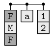
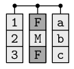
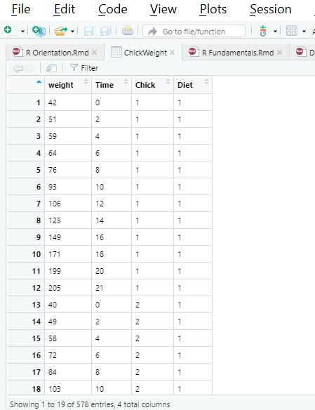

```{r, echo = FALSE}
die <- c(1, 2, 3, 4, 5, 6)
library(tidyverse)
```

As in any language, you need to understand the grammar and syntax to effectiely speak. Similarly, the key to a programming languages is understanding how data are stored and manipulated. Basic data types are things you will **manipulate on a day-to-day basis** in R. Differences in how they work is among the most common source of frustration among beginners and is key to getting the most out of the experience.

The next set of sections will teach you the basic's of R's object types along with how to store, retrieve, and change data values. We will also diver deeper into base R functions and practice making your own functions and loops. Along the way you will build a deck of 52 playing cards. When finished, your deck will look something like this:

<pre class="sourceCode r"><code class="sourceCode r"> face   suit value
 king hearts    <span class="dv">13</span>
queen hearts    <span class="dv">12</span>
 jack hearts    <span class="dv">11</span>
  ten hearts    <span class="dv">10</span>
 nine hearts     <span class="dv">9</span>
eight hearts     <span class="dv">8</span>
...</code></pre>

We will provide other contrived examples as well as illustrate concepts using the `Cars93`, `ChickenWeight`, and `msleep` datasets. Together, this chapter will work your way through many fundamental concepts in the R language. 

## R Objects

What is an object? An object is a thing – like a number, a dataset, a summary statistic like a mean or standard deviation, or a statistical test. R Objects come in many different shapes and sizes. There are simple objects like vectors (like our `die` and 'heights' examples earlier) which represent one or more numbers, more complex objects like dataframes which represent tables of data, and even more complex objects like hypothesis tests or regression which contain all sorts of statistical information.

Different types of objects have different **attributes**. For example, a matrix has a `dim` attribute (i.e., number of rows and columns) while a data set with variable headers has a `names` attribute. Don’t worry if this is a bit confusing now – it will all become clearer when you meet these new objects in later sections. Just know that objects in R are things, and different objects have different attributes.

### Atomic Vectors

<center>
{width=200px}
</center>
<br>

Perhaps the simplest object in R is an **atomic vector**, a one-dimensional object containing a single type of data. You can think of this like an excel column. In fact, our `die` object from the first section is a vector with six elements. You can create atomic vectors by grouping data values together with `c`

```{r}
die <- c(1, 2, 3, 4, 5, 6)
die
```

A **scalar** is a special instance of a vector with just one element of data, such as a single name or number. 

```{r}
# Examples of scalars
a <- 100
b <- 2 / 100
c <- (a + b) / b
a; b; c
```

You can save different types of data in R by using different types of atomic vectors. Altogether, R recognizes six basic types of atomic vectors: *doubles/numeric*, *integers*, *characters*, *logicals*, *complex*, and *raw*.  

<center>
{width=500px}
</center>
<br>

To create a card deck, you will need to use different types of atomic vectors to store different kinds of information (text and numbers). Different data types call for different data entry conventions (see picture above). For example, you create integer vectors by including a capital L with your input. You can create a character vector by surrounding inputs in quotation marks:

```{r}
integers <- c(1L, 5L)
text <- c("ace", "five")
```

Vector types help R behave as you would expect. For example, R will do math with atomic vectors containing numbers, but not atomic vectors containing character strings:

```{r eval = F, error = T}
sum(integers)     #this is okay
sum(text)    #this will not work
```

For our purposes we restrict discussion to the most commonly used vector types: **doubles** (i.e., numeric), **character**, and **logical**.  

#### Doubles

A double vector stores regular numbers. These numbers can be positive or negative, large or small, and have digits to the right of the decimal place. You can check how many distinct elements (i.e., numbers, words) are in a vector using the `length()` function. For instance, the vector `c(1,2,3)` has a `length` of `r length(c(1,2,3))`.

In general, R saves any number you enter as double. This can be verified using the `typeof` function. For example

```{r}
typeof(c(1,2,3))
typeof(die)
```

Some R functions and most users refer to doubles as numeric. Double is a computer science terms referring to the number of bytes your computer uses to store a number. In fact, if you ask R what `class` this vector belongs to it will return numeric rather than double. 

```{r}
class(c(1,2,3))
```

The distinctions between `typeof` and `class` are nuanced and will be revisited in the *attributes* section. For now and henceforth, we will refer to these data types as numeric. 

#### Characters

A character vector stores small pieces of text. You can create a character vector in R by typing a character or string of characters surrounded by quotes:

```{r}
text <- c("Hello",  "World")
text

typeof(text)
typeof("Hello")
```

You can combine different strings into a single string using `paste()` It can take any number of strings as well as an optional `sep` argument specifying how to seperate the strings. For example

```{r}
t1 <- "Hello"
t2 <- "how"
t3 <- "are you?"

paste(t1, t2, t3)
paste(t1, t2, t3, sep = "-")
paste(t1, t2, t3, sep = "")
```

Notice there is still a space between "are" and "you" in the last example. This is because R treats `t3` as a **single** string rather than two different words. Compare to the following:

```{r}
t1 <- "Hello"
t2 <- "how"
t3 <- "are"
t4 <- "you?"

paste(t1, t2, t3, t4, sep = "")
```

A string can contain more than just letters. You can assemble character strings from numbers or symbols as well. For instance, the vector `1` is numeric but the vector `"1"` is a character. You can tell strings from real numbers because strings are surrounded by quotes. 

A common error when first using R is to omit a quote when entering string data. Expect an error as R will start looking for a  non-existent object. 

```{r eval = F, error = T}
c("King", "Queen, "Jack")
```

#### Logical

Logical vectors stores `TRUES`s and `FALSE`s, R's form of Boolean data. Logicals are **very helpful** for doing comparisons and subsetting data, a topic we visit later. For example:

```{r}
3 > 4              #Is 3 greater than 4?
c(1, 2) > c(3, 4)  #Is 1 greater than 3 and is 2 greater than 4?
```

Any time you type `TRUE` or `FALSE` in capital letters (without quotations), R will treat your input as logical data. R also assumes `T` and `F` are shorthand for `TRUE` and `FALSE`, unless they are defined elsewhere (e.g., `T <- 500`). Since the meaning of `T` and `F` can change, its best to stick with `TRUE` and `FALSE`.

```{r}
logic <- c(TRUE, FALSE, TRUE)
logic

typeof(logic)
typeof(F)
```

#### Exercise - Create a Royal Flush

1. Create 3 different atomic vectors containing the face value, suit, and numerical values (consider ace low) of a royal flush, such as the ace, king, queen, jack, and ten of hearts. The face vector can contain the card rank (e.g., king), suit vector contain different groups (e.g., heart), and value corresponds to points (e.g., king 13, ace 1).

```{r}
face <- c("ace", "king", "queen", "jack", "ten")        # character vector
suit <- c("heart", "heart", "heart", "heart", "heart")  # character vector
value <- c(1, 13, 12, 11, 10)                           # numeric vector
face; suit; value                                       # Note: the ; allows you to execute multiple commands on the same line
```

Whew that was a lot of work. It would be time consuming to make a whole deck of cards this way. If only there was a faster way?

## Creating Vectors

Vectors can contain any number of elements. For instance, the numbers from one to ten could be a vector of length 10, and the characters in the English alphabet could be a vector of length 26. There are many ways to create vectors in R, some of which we've covered. Below are some commonly used functions to create vectors.

| Function| Example|Result |
|:-------------------------|:-----------------------------|:----------|
|     `c(a, b, ...)`|    `c(1, 5, 9)` |  `r c(1, 5, 9)`     |
|     `a:b`|    `1:5`|`r 1:5`    |
|     `seq(from, to, by, length.out)`|    `seq(from = 0, to = 6, by = 2)`|  `r seq(from = 0, to = 6, by = 2)`     |
|     `rep(x, times, each, length.out)`|    `rep(c(7, 8), times = 2, each = 2)`|  `r rep(c(7, 8), times = 2, each = 2)`
|

The simplest way to create a vector is with the `c()` function which we've already used several times. The `c` stands for concatenate, which means “bring them together”. The `c()` function takes several scalars as arguments, and returns a vector containing those objects. When using `c()`, place a comma in between the objects (scalars or vectors) you want to combine. 

Let's use the `c()` function to create a vector called `a` containing numbers from 1 to 5. 

```{r}
# Create object a with numbers from 1 to 5
a <- c(1, 2, 3, 4, 5)
a
```

You can create longer vectors by combining vectors you have already defined. For instance, we can create a vector from 1 to 10 called `x` by combining a smaller vector `a` from 1 to 5 with a vector `b` from 6 to 10. 

```{r}
a <- c(1, 2, 3, 4, 5)
b <- c(6, 7, 8, 9, 10)
x <- c(a, b)
x
```

You can duplicate vectors or interweave other numbers.

```{r}
c(a, a)
c(a, 100, 100, 100, b, 100, 100)
```

Finally, creating vectors using `c()` function works the same way with elements of different data types. 

```{r}
c(TRUE, FALSE, TRUE)
c("Serena", "June", "Nick", "Fred")
```

While the `c()` is straighforward, it is not always efficient. Say you wanted to create participant ids from 1 to 100. You definitely don't want to type all the numbers into a `c()` operator. Thankfully, R has many built-in functions for generating numeric vectors. We will explore three of them: `a:b`, `seq()`, and `rep()`. 

### a:b

The `a:b` function takes two numeric scalars `a` and `b` as arguments, and returns a vector of numbers from the starting point `a` to the ending point `b` in steps of 1. Here are some examples of the `a:b` function in action. You can go backwards or forwards, or make sequences between non-integers.

```{r}
1:5
5:1
-1:-5
2.77:8.77
```

### seq()

| Argument| Definition|
|:-------------------------|:-----------------------------|
|     `from`|    The start of the sequence |
|     `to`|     The end of the sequence |
|     `by`|    The step-size of the sequence|
|     `length.out`|   The desired length of the final sequence (only use if you don't specify `by`)|
|

The `seq()` is a more flexible cousin of `a:b`. Like `a:b`, `seq()` allows you to create a sequence from a starting number to an ending number. However, `seq()` has two additional arguments: `by` which allows you to specify the size of the spaces between numbers or `length.out` specifying the length of the final sequence.

If you use the `by` argument, the sequence will be in steps of input to the `by` argument

```{r}
# Create numbers from 1 to 10 in steps of 1. Note this is equivalent to 1:10
seq(from = 1, to = 10, by = 1)

# Integers from 0 to 100 in steps of 10
seq(from = 1, to = 100, by = 10)

# Reversed - must add negative sign to by argument
seq(from = 100, to = 1, by = -5)
```

Suppose we don't know the increment value for `by`, but we want some evenly distributed numbers of predefined length. This is where `length.out` argument comes into play.

```{r}
# Create 5 numbers from 0 to 20
seq(from = 0, to = 20, length.out = 5)

# Create 3 numbers from 0 to 100
seq(from = 0, to = 100, length.out = 3)

# Works for fractional increments as well, such as creating 10 numbers from 1 to 5
seq(from = 0, to = 5, length.out = 10)

```

### rep()

| Argument| Definition|
|:-------------------------|:-----------------------------|
|     `x`|    A scalar or vector of values to repeat |
|     `times`|     The number of times to repeat x |
|     `each`|    The number of times to repeat each value within x|
|     `length.out`|   The desired length of the final sequence|
|

The `rep()` function allows you to repeat a scalar (or vector) a specified number of times, or to a desired length. You can think of `times` as indicating how often to repeat the **vector** itself whereas `each` gives the number of times you wish to repeat each **element** within the vector. This is more easily shown with a few examples. 

```{r}
# Take the scalar 1 and repeat it 3 times
rep(x = 1, times = 3)

# Take the vector (1,2) and repeat it 3 times
rep(x = c(1, 2), times = 3)

# Repeat the character vector c("male", "female") 3 times
rep(c("Male","Female"), times = 3)

```

Notice `times` repeats vectors exactly as they appear. Now see what happens when running `each`.

```{r}
# Take the vector (1,2) and repeat 1 followed by 2 3 times
rep(x = c(1, 2), each = 3)

# Replicate Male 3 times, followed by Female 3 times
rep(c("Male", "Female"), each = 3)
```

In this case, each element is replicated 3 times before moving onto the next element in the series. 

You can combine the `times` and `each` arguments within a single `rep` function. For example, here's how to create the sequence {1, 1, 2, 2, 3, 3, 1, 1, 2, 2, 3, 3} with one call to `rep()`.

```{r}
rep(1:3, each = 2, times = 3)
```

In combination with `paste`, the `rep` function is useful for creating variable labels. For instance, say we needed to insert the labels treatment1 and treatment2 ten times into a dataset to differentiate experimental conditions. We could type this, but this becomes tedious. We can accelerate as follows:

```{r}
paste("treatment", rep(1:2, each = 10), sep = "")
```

### Exercise - Working with Vectors to Build a Deck of Cards

1. Create vector `x1` as 1 to 5 and vector `x2` as 6 to 10. Then, combine vector `x1` and `x2`.
2. Create the vector [0, 5, 10, 15] in two ways: using `c()` and the `seq()` with a `by` argument.
3. Use `rep` to create the three following vectors, each having 52 elements:
  + `value` vector representing the numerical values of the cards from 1 to 13, repeated 4 times 
  + `suit` vector representing the four classes of cards (e.g., hearts), each repeated 13 times 
  + `face` vector representing the value appearing on each card from lowest (ace) to highest (king), repeated 4 times

Note: check your answers to the 3rd question with the `length` function. This will tell you how many elements are in each vector. In this case, all three card vectors should have a length of 52. 

### Solution

```{r}
#First problem

x1 <- 1:5
x2 <- 6:10
c(x1, x2)
```

```{r}
#Second problem

x <- c(0, 5, 10, 15)
y <- seq(from = 0, to = 15, by = 5)
x; y
```

```{r}
#Third problem

value <- rep(1:13, times = 4)
suit <- rep(c("hearts", "diamonds", "clubs", "spades"), each = 13)
char <- c("ace", "two", "three", "four", "five", "six", "seven", "eight", "nine", "ten", "jack", "queen", "king")
face <- rep(char, times = 4)
```

## Simulate Random Data

As a language for statistical analysis, R carries functions for generating random data -- either from a vector of data (like how we sampled `die` rolls), or from an established **probability distribution**, like the Normal, Binomial, or Uniform distribution. Rather than create your own values, R can **generate** data given certain parameters (Mean, SD) or **randomly sample** values from a larger set. 

This serves many purposes. First, you can emulte other's work using published results to create data with the same properties. This allows evaluation and replication of other's models. Two, simulations can be used to advance psychological theories. Much like climate models, we can project what will hapen given different parameters and hypotheses and then compare these simulated results to observation. This has been done to understand many topics where conventional research strategies can be limited, including human development, complex learning, and emotional dynamics. Three, you can run monte carlo simulations to evaluate performance of different statistical estimators and determine study power. Finally, simulations can be used to help you learn. Successfully simulating data to emulate a statistical model will given you deeper intuition into the meaning and nature of your analyses. 

### Sample


### Exercise - Drawings and Earnings

1. Randomly sample 

## Attributes

| Function | Definition|
|:-------------------------|:-----------------------------|
|     `attributes(x)`| Access object's metadata |
|     `names(x)`| Retrieve or set names of an R object |
|     `dim(x)`| Retrieve or set dimensions of an R object |
|     `class(x)`| Class or type of object|

An attribute is a piece of information attached to an R object, including atomic vectors. Attributes won’t affect object values and are often hidden from view. You can think of an attribute as “metadata”; it is just a convenient place to put information associated with an object. R will normally ignore this metadata, but some R functions will check for specific attributes. These functions may use the attributes to do special things with the data.

You can view an object's attributes with `attributes`. The `attributes` function returns `NULL` if an object has no attributes. An atomic vector, like `die`, won’t have any attributes unless you give it some:

```{r}
attributes(die)
```

R uses `NULL` to represent an empty object. `NULL` is often returned by functions whose values are undefined. You can create a `NULL` object by typing `NULL` in capital letters. 

The most common attributes for an atomic vector are `names`, dimensions (`dim`), and `class`. You can use each of these functions to check whether objects have values for each of these attributes. We will briefly discuss each attribute in turn.

### Names

Names are simply labels for each element in a vector. R has a built-in data vector called `islands` providing areas for the world's 48 largest islands in thousands of square miles. If you print `islands` to your console you will see the square mileage and, above each number, the `name` associated with the island. These can be directly accessed using the `names` function.

```{r}
names(islands)
```

What if we tried to access the `names` attribute for our `die` object?

```{r}
names(die)
```

`NULL` indicates there are no names because we haven't assigned any! You can give names to `die` by assigning a character vector to the output of `names`. Think of this as filling in `NULL` with information. Importantly, the vector should include one name for **each element** in `die`

```{r}
names(die) <- c("one", "two", "three", "four", "five", "six")
```

Now `die` has a names attribute you can access, view, and manipulate.

```{r}
# Directly access names
names(die)

# View all attributes (just names for now)
attributes(die)
```

Like the `islands` vector, R displays names above the numerical values of `die` whenever you print the vector.

```{r}
die
```

However, as noted above, attributes **do not affect the values** of the vector. Hence, names won't change the values nor will names be affected if you alter the vector's values. 

```{r}
die + 1
```

You can use `names` whenever you wish to change the names attribute or if you decide to remove them all together.

```{r}
# change the names of die

names(die) <- c("I", "II", "III", "IV", "V", "VI")
die

# Remove names attribute from die by setting to NULL
names(die) <- NULL
die
```

### Dim 

So far we have only worked with one-dimensional vectors. However, most data structures - such as survey or experimental results - are stored in two-dimensional structures of rows and columns (or higher dimensions such as cubes). R handles this by assigning a `dim` attribute to vectors to transform them into an **n**-dimensional array. To do this, set the `dim` attribute to a numeric vector of length *n*. R will reorganize the elements of the vector into **n** dimensions, with each dimension having as many rows (or columns) as the as the *nth* value of the `dim` vector. For example, you could reorganize th `die` vector into a 2 x 3 matrix (2 rows by 3 columns).

```{r}
dim(die) <- c(2, 3)
die
```

or a 3 x 2 matrix (3 rows by 2 columns)

```{r}
dim(die) <- c(3, 2)
die
```

You can even assign the vector to a matrix with one column or row, effectively giving the vector an arbitrary dimension beyond its `length()`.

```{r}
# stack vector into 1 column with 6 rows
dim(die) <- c(6, 1)
die

# spread vector into 6 columnas with 1 row
dim(die) <- c(1, 6)
die
```

Note R will always use the the **first value** in `dim` for the number of rows and the **second value** for number of columns. In general, rows always precede columns in R operations dealing with matrices. We can spread the data out into higher dimensions, such as a hypercube with three dimensions 1 x 2 x 3. Since we often do not deal with such structures, we will focus on 2-dimensional arrays, also known as `matrices`.  

### Matrices

| Function | Description| Example |
|:-------------------------|:-----------------------------|:-----------------------------|
|     `matrix(x, nrow, ncol, byrow)`| Create a matrix from vector `x` | `matrix(x = 1:12, nrow = 3, ncol = 4)` |
|     `cbind(a, b, c)`| Combine vectors as columns in a matrix or dataframe | `cbind(1:5, 6:10, 11:15)` |
|     `rbind(a, b, c)`| Combine vectors as rows in a matrix or dataframe  | `rbind(1:5, 6:10, 11:15)` |
|

A **matrix** is a rectangular arrangement of the **same type** of data elements into rows and columns. Matrices form the mathematical machinery of many multivariate statistical techniques, such as factor analysis, multivariate regression, and structural equation modeling. You can do traditional matrix operations in R, such as transposition with `t`, finding a determinant with `det`, and running inner or outer multiplication with the `%*%` and `%o% operators, respectively. 

In R, any vector with 2 dimensions automatically becomesa a matrix (see classes below) with The `dim` attribute determining size in terms of height and width. It may be easier to think of a matrix as a combination of `n` vectors, where each vector has a length of `m`. For instance, in the image below the vector has a length of 3 while the matrix is three vectors each 3 elements long (a 3 x 3 matrix). 

<center>
{width=500px}
</center>
<br>

The `matrix()` function creates a matrix from a single vector of data. The function has 4 main inputs: `data` - a vector of data, `nrow` - the number of rows you want in the matrix, `ncol` - the number of columns you want in the matrix, and `byrow` - a logical value indicating whether you want to fill the matrix by rows. Check the help function `?matrix` to see some additional inputs and examples. 

| Argument| Definition|
|:-------------------------|:-----------------------------|
|     `data`|    Optional data vector to be reorganized into a matrix |
|     `nrow`|    Desired number of rows |
|     `ncol`|    Desired number of columns |
|     `byrow`|   Logical. If False, matrix filled by rows otherwise filled by rows|

```{r}
matrix(
  data = c(1:10),   # the data elements
  nrow = 2,         # the number of rows
  ncol = 5,         # the number of columns
  byrow = F,        # default argument. Fill by column
  )
```

We can change the above to give us 5 rows and 2 columns instead

```{r}
matrix(data = 1:10,
       nrow = 5,
       ncol = 2)
```

Say we wanted to repeat above, but fill by row instead of column

```{r}
matrix(data = 1:10,
       nrow = 5,
       ncol = 2,
       byrow = TRUE)
```

You can also populate a matrix with characters. However, you *cannot* mix and match numbers with words. R will coerce everything to be of a same type (more on this later). 

```{r}
# matrix of characters with 2 rows

matrix(c("a", "b", "c", "d"), nrow = 2)
```

`cbind()` and `rbind()` can be used to create matrices by combining several vectors of the same length. You can also use these functions to add new rows or columns of data to an existing matrix or dataframe (covered later). `cbind()` combines vectors as columns, while `rbind()` combines them as rows. Let's use these functions to create a matrix with the numbers 1 through 30. First, we'll create three vectors of length 5, then we'll combine them into one matrix. 

```{r}
x <- 1:5
y <- 6:10
z <- 11:15

# create a matrix where x, y, and z are columns
cbind(x, y, z)

# create a matrix where x, y, and z are rows
rbind(x, y, z)

# Can also use to add on columns or rows to existing matrices

m <- cbind(x, y, z)
xx <- 16:20
cbind(m, xx)

```

#### Exercise - Build a Matrix

1. Create the following matrix

```{r, echo = F}
matrix(1:4, nrow = 2, ncol = 2)
```

2. Complete the following matrix using your `die` object

```{r, echo = F}
matrix(die, nrow = 2, byrow = TRUE)
```

3. Create the following three of a kind matrix, which stores the name and suits of different cards

```{r, echo = F}
hand <- c("king", "king", "king", "heart", "spade", "club")
matrix(hand, nrow = 3)
```

4. Use `cbind` to merge your `suit` and `face` vectors into a matrix. 

#### Solution

```{r, eval = F}
# Problem 1
matrix(1:4, nrow = 2, ncol = 2)
```

```{r, eval = F}
# Problem 2
matrix(die, nrow = 2, byrow = TRUE)
```

```{r, eval = F}
# Problem 3 - multiple approaches

hand <- c("king", "king", "king", "heart", "spade", "club")

matrix(hand, nrow = 3)
matrix(hand, ncol = 2)
dim(hand) <- c(3, 2)

# Could also start with character vector listing cards in alternating order. In this case, you will need to ask R to fill matrix by row instead of by column.

hand1 <- c("king", "heart", "king", "spade", "king", "club")
matrix(hand1, nrow = 3, byrow = TRUE)
matrix(hand1, ncol = 2, byrow = TRUE)

```


```{r}
# Problem 4 - cbind

cbind(suit, face)
```

### Class

Recall earlier we ran `typeof` and `class` on the vector `c(1,2,3)` and received different output. This arises from subtle differences in the evolution of R from S as a language during the 1980s, and is further discussed on [stack overflow](https://stackoverflow.com/questions/8855589/a-comprehensive-survey-of-the-types-of-things-in-r-mode-and-class-and-type). The distinction is trivial. The only thing you need to know is `class` is an attribute assigned to different objects which determine how generic R functions, such as `mean` or `subset`, operate with it. You can think of type as the *physical* representation of data whereas *class* is a *logical blueprint* giving R further information on how to represent and use the object. 

To illustrate, note that changing the dimensions of your object will not change the type of object, but it *will* change the object's `class` attribute:

```{r}
dim(die) <- c(2, 3)
typeof(die)
class(die)
```

A matrix is just a special case of an atomic vector. For example, every element of the `die` matrix is still a double, but now the elements have been arranged into a new 2 x 3 structure. R added a `class` attribute to `die` when you changed its dimensions which now describes `die`’s new format. Many R functions will specifically look for an object’s `class` attribute, and then handle the object in a predetermined way based on the attribute. We will briefly look at two frequently used R classes designed for specialized data: **Times** and **Factors**

### Dates and Times

The class attribute allows R to represent data types beyond numbers and words, often in a way that reflects a hybrid of more fundamental types. For instance, time looks like a character string when you display it, but underneath is storeid as a `double` or numeric form. It has two attached classes: `POSIXct` and `POSIXt`.

```{r}
now <- Sys.time()
now

typeof(now)

class(now)
```

`POSIXct`, also known as **calendar time**, is the number of seconds since the beginning of 1970, in the Universal Time Coordinate (UTC) timezone (GMT as described by the French). For example, the time above occurss `r format(unclass(now), scientific = F)` seconds after 1970-01-01 in UTC time. This means in the `POSIXct` system, R is storing this information as the actual number `r format(unclass(now), scientific = F)`. You can directly access this vector by removing the `class` attribute from `now` using the `unclass` function. 

```{r}
unclass(now)
```

So how does R change this into a date? A corresponding class is `POSIXlt`, or **local time** which is a list of different time attributes (e.g., days, months, years, hours, timezone). To view these components directly, we need to first **convert** a date-time format using `as.POSIXl` and then use `unclass` to pull out the raw information.

```{r}
unclass(as.POSIXlt(Sys.time()))
```

R integrates these two formats together with its own virtual class `POSIXt` to change seconds into a human readable date format, such as January 1, 1970, 1999/12/31, or 2019-07-11 14:16:55. This enables operations such as subtracting different date formats. For instance, you could do the following:

```{r}
# Subtract two dates formatted with different symbols
as.Date("10-12-25") - as.Date("09/12/25")
```

You can also directly add seconds to a date and R will produce a new date. Say we wanted to know how many years in the future before a billion seconds elapses.

```{r}
# Add a billion seconds to the current time 
Sys.time() + 1000000000
```

Wow. That is over 30 years from today's date! 

Or, you could take any number and assign it the `POSIXct` class to see how much time elapsed since Jan 1, 1970. For example, how long does it take for a million seconds to elapse?

```{r}
# store 1 million as an object mil
mil <- 1000000   
mil

# Assign time classes to the number one million and print results
class(mil) <- c("POSIXct", "POSIXt")
mil
```

January 12, 1970. Wow! A million seconds goes by much faster than a billion. This conversion works well because the `POSIXct` doesn't require further attributes or specification. However, in general it is a bad idea to try and force the class of an object. MOre often than not this will lead to errors and incompatibility across functions.  

There are numerous data classes in R and its packages, and new classes are invented every day. This is part of what makes R unique but also frustrating to many programmers. Classes allows for idiosyncratic differences in how data are stored and represented, leading to variability in how programs run and function. This is rarely problematic as most classes are not hard baked into R's programming language. However, there is one exception that is so ubiquitous it should be learnt along vector types and is the chagrin to many. That class is `factors`.

### Factors

Factors are R's way of storing categorical variables, like ethnicity or type of animal, and independent variables, such as treatment and control or different experimental conditions. Factors are an important class for statistical analyses and **will** alter your analyses and plotting if not careful. For example, ANOVA functions often expect factors as input. 

There are a few unique properties of factors. First, they can only take on a predefined set of discrete levels (e.g., experiment or control - nothing else). Second, factors are stored as integers (either ordered or unordered), and unique labels associated with these integers. While factors look (and often behave) like character vectors, they are actually integers under the hood. Let's look at some examples. 

Below is a relationship vector containing the romantic status of 4 individuals. We have abbreviated the labels. 

```{r}
# Relationship status of 4 people. S = single and M = Married. 

relstat <- c("S", "M", "M", "S")
```

There are only **two** possible categories or **factor levels** in this data: S for Single and M for Married. The `factor` function can take vectors like this and automticallyy encode them as factors.

| Argument| Definition|
|:-------------------------|:-----------------------------|
|     `x`|    Vector of data to convert (accepts character, numeric, logical) |
|     `levels`|    Vector specifying unique factor levels. Can be rearranged to set the order. |
|     `labels`|    Optional character vector to assign printed labels. Must be same order as `levels`.|
|     `ordered`|   Logical. If TRUE, indicates levels should be treated as ordinal |
|

If you enter `relstat` into `factor`, R recodes the data as integers and store the results in an integert vector. It also assigns a `levels` attribute to the integer in alphabetic order. Finally, the `class` attribute now contains `factor`. 

```{r}
relstat <- factor(relstat)

typeof(relstat)        #Verify the data is really integer behind the hood
attributes(relstat)    # Show the levels and class attribute  

relstat

```

R will assign `1` to the level `M` and `2` to the level `S` (because `M` comes first in the alphabet even though the first element in this vector is `S`). You can see this implicit ordering by calling the `levels()` function or see exactly how R is storing the factor with `unclass`. Underneath the hood it is more apparent how R swaps the numbers with the levels attribute when printing a factor object. 

```{r}
levels(relstat)
unclass(relstat)
```

Sometimes factor orders matter. Othertimes you may want a certain level to be the referent (i.e., comparison group) in an analysis. In either case, you can use the `levels` function to specify a new ordering. For instance, if we wanted single people to be the referent we could do the following.

```{r}
relstat <- factor(relstat, levels = c("S", "M"))
relstat
```

Notice `S` appears before `M` in levels meaning we have succesfully flipped the ordering. Say we wanted R to further spell out what these factor abbreviations mean. We can do so with the `labels` function. 

```{r}
factor(relstat, labels = c("Single", "Married")) # Note labels will correspond to current level order
```

Be careful with labels. They must be in the **same order** as levels. If you flip them, R has no way of telling you the labels are wrong. In the following, we have mislabeled the data so now Single shows up as Married and vice versa. 

```{r}
relstat
factor(relstat, labels = c("Married", "Single"))
```

If the factor contains ordinal information (e.g., "low", "medium" and "high") then you may want to set `ordered` to true. R will now treat this as quasi-numerical which allows minimal calculations. Say we were doing a study on food intake and wanted to identify the condition with the lowest amount of eating. 

```{r}
# food factor without level information. Ordered based on alphabet

food <- factor(c("low", "medium", "high", "high", "low", "medium"))
levels(food)
```
```{r eval = F, error = T}
# Switch levels but do not change ordered to true

food <- factor(food, levels = c("low", "medium", "high"))
levels(food)
min(food)     # as for smallest level. Will not work.
```
```{r}
# Switch levels and set ordered to true

food <- factor(food, levels = c("low", "medium", "high"), ordered = TRUE)
min(food)     # Works
```

In the last example, these factors are represented by numbers (1, 2, 3) rather than nominal integer values. 

Similiar to the `rep` function, you can use the `gl` function to generate factors. It takes two integers as input, an `n` indicating the number of levels and a `k` indicating the number of replications. Using our relationship status example with the new category of Divorced, we could do the following.

```{r}
gl(3, 3, labels = c("Single", "Married", "Divorced"))
```

A final yet **important** note, R has a nasty habit of converting character strings to factors when you load and create data. Programmers and researchers **hate** this behavior because R is making decisions without your consent. Even numeric values are sometimes converted to factors, often when a missing value is encoded with a special symbol usch as `.` or `-`. We will discuss this more in the data management section.

In cases where a string is inadvertently converted to a factor, use the `as.character` function to change back to pure strings. 

```{r}
as.character(relstat)
```

#### Exercise - Factor Conversion

1. Convert your `suit` vector to a factor with the following level order: hearts, diamonds, spades, clubs

2. Convert your `face` vector to a factor and then unclass. What do the numbers indicate? Now, convert `face` to another factor with only the levels `ace`, `king`, and `queen`. what happens?

## Coercion and Conversion

Many card games assign different point values to different cards. For instance, in blackjack all face cards are worth ten points. What happens if we try to make a vector by combining "king", "heart", and 10 together? Test it out.  

```{r}
card <- c("king", "heart", 10)
card
typeof(card)
```

R has changed the number 10 into a character! If you recall, R requires all elements in a vector (including matrices) to be of the same type; if you violate this rule, R will convert elements to a single type of data. See what happens if we try to combine logicals and numbers in a matrix.

```{r}
a <- rep(TRUE, 5)  # vector of 5 T values
b <- 1:5           # vector of numbers

cbind(a, b)        # combine logic and numbers
```

The logical values are now numbers! These alterations may seem inconvenient, but they are not arbitrary. R always follows the same coercion rules. Once you are familiar with the rules, you can actually use this behavior for many useful things! 

Whenever you attempt to combine different data types, R **coerces** everything in the vector to the most flexible type. Types from least to most flexible are: logical, double, and character. Hence, if there is just one "character string" in a vector, R will convert everything else in the vector to a character string. If a vector only contains logicals and numbers, R will convert all logicals to numbers: every `TRUE` becomes a 1, and every `FALSE` becomes a 0, as shown below. 

<center>
{width=500px}
</center>
<br>

This arrangement preserves information. It is easy to look at a character string and tell what information it use to contain. For example, you can easily spot the origins of "TRUE", "True", and "1" in a character vector. You can also easily back-transform a vector of 1s and 0s to `TRUE`s and `FALSE`s. 

```{r}
sum(c(TRUE, TRUE, FALSE, TRUE))     # Under the hood, R converts the T's to 1 and the F to 0
```

R took the `sum` function and counted the number of `TRUE`s in the logical vector (`mean` calculate proportion). We will revisit this behavior in later sections. 

You can instruct R to coerce a vector or other R objects to a different data types or class using the `as` function. We did this using the `as.POSIXlt` and `factor` commands to convert numbers and strings into dates and factors. Some more common conversions are changing character vectors into other types, making factors into continuous numbers, or forcing numbers into logical statements. For example, you may decide what you thought was a discrete-like variable is better represented as continuous and desire to change a factor to a number. 

<center>
{width=500px}
</center>
<br>

Here are some simple examples

```{r}
as.character(1:2)
as.logical(0:1)
as.numeric(c(TRUE, FALSE))
as.numeric(as.logical(c("TRUE", "FALSE", "blah")))  # Nest as functions to downgrade multiple data types
```

Many datasets contain different kinds of data which programs like Excel and SPSS save in single data set. Don't worry, R can do this too! To avoid issues of coercion, we use two special object types: **lists** and **data frames**.

**What the Hell** you might say - if vectors and matrices can't hold multiple types of data, why even use them? A few answers. First, because they are simpler, matrices and vectors tak up less computational space and execute operations faster. Second, these data structures are needed for certain mathematical operations on large number sets. There is a whole field of matrix algebra dedicated to just said operations! Three, sometimes you only require a single data type making vectors and matrices a better way of organizing your data. 

#### Exercise - Run and Evaluate Coercion

1. Perform the following coercions. What happens in each case and why?

  + Convert `value` to a character
  + Convert `suit` to a factor
  + Convert `face` to numeric

2. What happens to the values in each of the following:

  + `log_num <- c(TRUE, 2, FALSE, 0, 1, TRUE)`
  + `char_num <- c("a", 1, "b", 2, "c", 3)`
  + `tricky <- c(1, 2, 3, "4")`

3. How many values in `combined_logical` object end up as "TRUE" (i.e., as a character)  

```{r}
num_logical <- c(1, 2, 3, TRUE) 
char_logical <- c("a", "b", "c", TRUE) 
combined_logical <- c(num_logical, char_logical) 
```

## Lists

<center>
{width=150px}
</center>
<br>

Lists are like atomic vectors because they group data into a one-dimensional set. However, lists do not group together individual values; lists group together R objects of different types and lengths. For example, we could include a numeric vector length 50 in the first element, character vector length 1 in the second element, and a new list of length 2 in its third element. To do so, use the `list` function which operators like the `c` function for vectors.

```{r}
list <- list(1:50, "Hi", list(TRUE, FALSE))
list  
```

The initial double-bracketed indices (e.g., `[[1]]`) tell you which element of the list is being displayed. For instance, `[[1]]` refers to the `1:50` numerical vector, `[[2]]` refers to the `"Hi"` character vector, and `[[3]]` refers the sub-list. The single-bracket (e.g., `[1]`) indices tell you which sub-element of a list element is being displayed. For example, `30` is the 30th sub-element of the first element in the list. `Hi` is the first sub-element of the list's second element. This two-system notation arises because each eleemnt of a list can be *any* R object, including a new vector (or list) with its own indices. For instance, `TRUE` is embedded in its own list within a list, hence the `[[3]][[1]]` notation stating the first element of the 2nd list which is itself the 3rd element of the 1st list. Bonkers right!

The above example is a little archaic and doesn't illustrate the real power of lists. Many R functions store output in lists because they are a highly flexible storage containers. These lists often *name* the components, such as **coefficients**, **standard errors**, **tvalue**, and **warning messages** to store output of various analyses, such as a linear regression. This allows researchers to pull just the information they need, whether it be a single *p*-value or an entire set of beta weights.

For example, say your a super huge HBO fan and decided to store information all about the popular show Game of Thrones.  

<center>
{width=400px}
</center>
<br>

In this `list`, you might provide the show's title, number of seasons, name of your favorite characters, and small set of numeric reviews out of 10. You can assign names to each component by typing the label followed by an `=` sign and then an input vector. This allows several vectors of different length and type to accomodate different forms of information. Here is an example.

```{r}
GOT <- list(showname = "Game of Thrones",
            seasons = 8,
            characters = c("Tyrion Lannister", "Jaime Lannister", "Bran Stark", "Arya Stark",
                           "Jon Snow", "Daenerys Targaryen"),
            reviews = c(9, 10, 9, 10, 10, 8)
            )
GOT
```

As you can imagine, the structure of lists can become quite complicated, but this flexibility makes lists a useful all-purpose storage tool in R: you can group together anything with a list. Let's practice. 

#### Exercise - Make a List

1. Use a **named** list to store a single playing card, like the ten of clubs, which has a point value of 10. The list should save the face of the card, the suit, and point value as seperate labeled elements. 

#### Solution

```{r}
card <- list(face = "ten",
             suit = "clubs",
             value = "10")
card
```

We can also use a list to store a whole deck of cards. You could save each card as its own list in a list (52 sublists) or have three elements each with all suits, values, and faces (three 52 element vectors). However, there is a much cleaner way to represent this information using a special type of list, known as a **data frame**. 

## Data Frames

| Function | Description| Example |
|:-------------------------|:-----------------------------|:-----------------------------|
|     `data.frame()`| Create a dataframe from named columns | `data.frame(age = c(19, 21), sex = c("m", "f")` |
|     `str(x), summary(x)`| Show structure (i.e., dimensions and classes) and summary statistics | `str(mtcars), summary(mtcars)` 
|     `head(x), tail(x)`| Print the first few rows (or last few rows). | `head(mtcars), tail(mtcars)` 
|     `nrow(x), ncol(x), dim(x)`| Count the number of rows and columns  | `nrow(mtcars), ncol(mtcars), dim(mtcars)` 
|     `rownames(), colnames(), names()`| Show the row (or column) names | `rownames(mtcars), names(mtcars)` 
|

A data frame is the most common way of storing data in R, and if used systematically makes data analysis easier. Under the hood, a data frame is a list of equal-length vectors. This makes it a 2-dimensional structure, so it shares properties of both the matrix and the list. It is R's equivalent to an Excel spreadsheet because it stores data in a similiar format.

Data frames group vectors together into a table where each vector becomes a column. Each column can contain different data types but all cells within a column must be the same type of data. 

<center>
{width=150px}
</center>
<br>
To create a dataframe from vectors, use the`data.frame` function. The `data.frame()` function works very similarly to `cbind()` - the only differences is that in `data.frame()` you specify names for each of the columns as you define them. Remeber to separate each vector by a comma. Let's create a simple dataframe called `survey` using the `data.frame` function with a mixture of text and numeric columns. 

```{r}
# Create a dataframe of survey data

survey <- data.frame("index" = c(1, 2, 3, 4, 5),
                     "sex" = c("m", "m", "m", "f", "f"),
                     "age" = c(99, 46, 23, 54, 23))

survey
```

In the previous code, I named the columns in `survey` `index`, `sex`, and `age`, but you can name them whatever you want. If you look at the `typeof` function for a data frame, you will see it is actually a list. In fact, each data frame is a list with class `data.frame` which makes it behave like a matrix. 

```{r}
typeof(survey)
class(survey)
```

Two useful functions for getting an overall sense of your data are `str` and `summary`. `str` provides the dimensions, types of objects grouped together, and other summary information for a data.frame (or list). `summary` provides some descriptive statistics. Let's look at each in turn.

```{r}
str(survey)
```

You can see there are 5 participants with 3 variables, each of which is listed along with its data type. R will display the first several values for each variable. Second, it converted the string column `sex` to a factor, assuming there were only 2 levels, `f` and `m`. Let's run `summary` on `survey`.

```{r}
summary(survey)
```

R has given us frequencies for the `sex` factor and descriptive information such as a sense of the range, quartiles, and central tendencies for numerical columns of `index` and `age`. This can be helpful for finding outliers, data entry errors, or getting a sense of your data's distributions. 

One key argument to `data.frame()` and similiar functions is `stringsAsFactors`. As noted above, R went ahead and changed your string variables to factors without your permission. Sometimes this is what you want. More often than not this leads to weirdness and frustration. Take the following example where there was a slight alteration in how the `sex` data were entered. 

```{r}
survey2 <- data.frame(index = 1:5,
                      sex = c("m", "M", "m", "F", "f"),   # notice upper and lower cases
                      age = c(99, 46, 23, 54, 23))
str(survey2)
```

Notice R now thinks sex has **four levels** instead of **two**. This can lead to all kinds of silliness in analyses and plots. Things become even messier when R tries to make data like addresses, phone numbers, or other raw textual data into very large factors. To prevent this from happening, set the argument `stringsAsFactors = FALSE` within `data.frame`.

```{r}
survey2 <- data.frame(index = 1:5,
                      sex = c("m", "M", "m", "F", "f"),  
                      age = c(99, 46, 23, 54, 23),
                      stringsAsFactors = F)               # Add this argument
str(survey2)
```

Looking at the new version we can see no factors were retained. There are several other useful helper functions to navigate dataframes. To quickly get a glimpse of the first or last rows of a dataframe, use `head` and `tail`. We can quickly glimpse the built-in R dataset `ChickenWeight` to get a sense of the information inside.

```{r}
# Show first few rows
head(ChickWeight)
```
```{r}
# Show last few rows
tail(ChickWeight)
```

We can run `View()` to see a new window like the one below showing the data. 

```{r evaluate = FALSE}
View(ChickWeight)
```

<center>
{width=300px}
</center>
<br>

Finally, all name and dimensional attributes can be accessed using the same functions as before, `names` and `dim`. There are also the more specialized `nrow` or `ncol` as well as `rownames` or `colnames` options for accessing just one side.  

```{r}
nrow(ChickWeight)
dim(ChickWeight)

names(ChickWeight)
colnames(ChickWeight)
```

We will explore how to slice, modify, and run calculations on data frames and vectors. R Studio provides a helpful set of cheat sheets on a variety of topics, including how to work with basic R objects. Here is a snippet of some basic notations, along with illustrations of subsetting which we will cover shortly. 

<center>
{width=300px}
</center>
<br>

### Available Dataframes in R

Now you know ho to use functions like `cbind()` and `data.frame()` to make your own data frames. However, for demonstration purposes, it's frequently easier to use existing data frames rather than always creating your own. Thankfully, R has use covered: R has several datasets that come pre-installed in a package called `datasets` -- you don't need to install this package, it's included with base R. In addition, there are some useful datasets in the `tidyverse` package which we will use to illustrate certain data wrangling principles. These data sets allow all R users to test and compare code on the same information and see if they can replicate other examples. To see a complete list of all the datasets included in the datasets package, run the code: `library(help = "datasets")`. The table below shows a few datasets that we will be using in future examples.

| Dataset| Description| Rows | Columns | 
|:-----------|:-----------------------------|:----|:-----|
|     `ChickWeight`|  Experiment on the effect of diet on early growth of chicks. | 578 | 4 |
|     `Cars93` (load `MASS`)| Features of different cars from 1993. | 93 | 27 |
|     `msleep` (load `tidyverse`)| Sleep habits for a variety of mammals and insects.  | 83 | 11 |
|     `PlantGrowth`|Results from an experiment to compare yields (as measured by dried weight of plants) obtained under a control and two different treatment conditions. | 30 | 2 |

#### Exercises - Building and Exploring Dataframes

1. A data frame is a great way to build an entire deck of cards. You can make each row a playing card and each column a type of value - each with its own appropriate data type. Using the `data.frame` function, combine your `face`, `suit`, and `value` vectors into a data.frame called `deck`. 

2. Use `str` on the `Cars93` data frame (available from `MASS` package). What are the dimensions and data types? Can you deduce what some of the variables tell us about different cars?

3. Use the `summary` on the `ChickWeight` data frame. What is the average weight of a baby Chick (reported in grams)? Further, can you figure out how many `diet` conditions exist and how many days the chickens were measured?

#### Solutions

```{r}
# Solution 1
deck <- data.frame(face = face,
                   suit = suit,
                   value = value)
```

```{r}
# Solution 2
str(MASS::Cars93)
```

```{r}
# Solution 3
summary(ChickWeight)
```

## Summary 

You can work with R data using five different objects, each of which lets you store different types of values in different relationships. The vector is the most fundamental R unit from which everything evolves. Vectors have the basic properties of `length` and data type (`typeof`). Lists are a more generic vector allowing objects of different types and lengths. More sophisticated objects inherit **attributes** or metadata which can modify their functionality. A matrix, for instance, is a vector with a 2-dimensional property whereas a data frame is a list that acts like a matrix. Of these objects, data frames are by far the most useful for social science. Data frames store the most common forms of data accessed by others programs such as excel or SPSS, tabular data. All packages operate through these fundamental objects, hence understanding their structure allows you to exploit R's full potential.  

<center>
{width=500px}
</center>
<br>

# R Notation

By now you are a whiz at data structures and the R interface. You can access all the contents of `Cars93`, your `deck` of cards, and other data frames. However, you will often want to access specific **subsets** of your data based on some criteria. For instance, we may want to randomly sample just **one** card (i.e., row) from your `deck`, much like we are dealing. Or, for the `Cars93` data set, perhaps you want to look at just the last 10 vehicles, choose only the priciest vehicles (e.g., > 100k), or select only vans. 

This section will help you master subsetting by starting with the simplest type: subsetting an object with `[`. We will gradually expand into more complex operations. Subsetting is a natural complement to `str()`. `str()` shows you the structure of any object, and subsetting allows you to pull out the pieces you are interested. 

To begin in pulling things out, you will need to access specific values of an R object using **indexing** with brackets `[ , ]`. To extract a value or set of values from a data frame, for example, you write the data frame's name followed by a pair of hard brackets:

```{r, eval=FALSE}
deck[ , ]
```

Between the brackets will go two indexes separated by a comma. The indexes tell R which values to return. R will use the first index to subset the rows of the data frame and the second index to subset the columns. You can think of the notation as `data[rows, columns]`. 

You will have a choice as to what you put into `rows` and `columns` in writing indexes. For simplicity, we discuss 4 different possibilities which can be used in combination. They are all simple yet handy in different circumstances. You can create indices with:

* Integers (positive and negative)
* Blank spaces
* Names
* Logical Values

### Integers

R treats integers just like *ij* notiation in linear algebra: `deck[i, j]` will return the *ith* row in the *jth* column. For example

```{r}
head(deck)

# Return element from row 1, column 1
deck[1, 1]

# Return element from row 4, column 3 
deck[4 ,3]
```

To extract more than one value, use a vector of positive integers. For example, you can return the first row of `deck` with `deck[1, c(1,2,3)]` or `deck[1, 1:3]`.

```{r}
# Row 1, all columns
deck[1, 1:3]
```

R returns the values of `deck` that are in both the first row and first, second, and third columns. You can even access the same set of elements multiple times using repetition.

```{r}
# Repeat the first row and first three columns three times
deck[c(1, 1, 1), 1:3]
```

Note R won't actually **remove** these values from the `deck`; rather, R gives you a new set of values copied from the originals. You can then save these values into a new R object with the assignment operator. 

```{r}
new <- deck[1, 1:3]
new
```

<center>
{width=500px}
</center>
<br>

R's notation system is not limited to data frames. You can use the same syntax to select values in any R object, as long as you supply one index for each object dimension. For example, you can subset a one-dimensional vector using a single index.

```{r}
dog_breeds <- c("Labrador", "Golden Retriever", "Poodle", "Bulldog", "Beagle", "German Shepherd", "Rottweiler")

# What is the first dog breed?
dog_breeds[1]

# What are the first five dog breeds?
dog_breeds[1:5]

# What is every second dog breed?
dog_breeds[seq(1,length(dog_breeds),2)]    # Use length to set max value for a vector

```

Finally, negative integers do the exact *opposite* of positive integers: R returns every element *except* the elements in a negative index. For example, `deck[-1, 1:3]` returns everything *but* the first row of `deck`. `deck[-(2:52), 1:3)] *only* returns the first row and discards everything else. Negative integers are often a more efficient way to subset if you want to include a majority of a data frame's rows and columns.

```{r}
# Eliminate just the first row
deck[-1, 1:3]
# Eliminate everything but first and last row
deck[-2:-51, 1:3]
# Eliminate last column for first row
deck[1, -3]
```

### Blank

If you want to look at an **entire** row or column of a matrix or dataframe, you can leave the corresponding index blank. For example, to see the entire 1st row of the `ChickWeight` dataframe we can set the row index to 1 and leave the column index blank. 

```{r}
# Give me the 1st row (and all columns) or ChickWeight
ChickWeight[1, ]
```

This particular Chicken weighed 42 grams at birth and is in the 1st diet condition. Similarly, if you wanted to get the entire 3 and 4th column (and all rows), set the column index to `3:4` or `c(3,4)` and leave the row index blank.

```{r}
ChickWeight[ ,3:4]
```

One thing to note is that if you select a **single** column, R will return a vector rather than a dataframe. 

```{r}
ChickWeight[ ,4]
```

If you would like a data frame instead, you can add the optional argument `drop = FALSE` between brackets.

```{r}
ChickWeight[ , 4, drop = FALSE]
```

### Logical

If you supply a vector of `TRUE`S and `FALSE`S as your index, R will match each `TRUE` and `FALSE` to a row or column in your data frame. R will then return each row corresponding to a `TRUE`. In the image below, the command would return just the numbers 1, 6, and 5.

<center>
{width=500px}
</center>
<br>

It may help to imagine R using the logical vector as a *filter* which asks, "Should I return this particular value?", and then consulting the corresponding logical vector for its answer (`TRUE` = yes, `FALSE` = no). 

You could create logical vectors directly using `c()`. For example, I could could access every other value of `a` below using my own logical index.

```{r}
a <- c(1, 2, 3, 4, 5)
a[c(TRUE, FALSE, TRUE, FALSE, TRUE)]  # Return every other value
```

As you can see, R returns all values of the vector `a` for which the logical vector is `TRUE`. Generally, this system works best when your logical vector is as long as the dimension you are trying to subset. Take our `deck` of cards. Say I wanted to retain either just the first 2 columns or just the first 13 values. 

```{r}
# Retain only first 2 columns
deck[1, c(TRUE, TRUE, FALSE)] 

# Retain only first 10 rows
rows <- c(TRUE, TRUE, TRUE, TRUE, TRUE, TRUE, TRUE, TRUE, TRUE, TRUE, F, F, F,
          F, F, F, F, F, F, F, F, F, F, F, F, F, F, F, F, F, F, F, F, F, F, F, F, F, F, 
          F, F, F, F, F, F, F, F, F, F, F, F, F)
deck[rows, ]
```

This may seem highly impratical - who wants to type out so many `TRUE`S and `FALSE`S. However, this technique will become much more powerful when we explore 

### Names

Finally, you can ask for the elements you want by name if the object has a name attribute. Data frames almost always have names, making this a convenient way to access specific variables when familiar with the data. 

```{r}
# Just the face and suit for row 1
deck[1, c("face", "suit")]

# the entire value column
deck[ , "value"]
```

### The Dollar Sign (`$`) and Double Brackets (`[[]]`)

Data frames and lists obey an optional second system of notation. You can extract values from either with the `$` syntax in the form of `df$name` where `df` is the name of the dataframe and `name` is the name of the column. RStudio has a nice auto-complete feature where using `$` will bring up a list of available elements within the object. This operation will then return the column you want as a vector. Let's pull out just the `values` column from our `deck`.

```{r}
deck$value
```

The `$` notation is incredibly useful. Because `$` returns a vector, you can easily run all kinds of functions on it, such as `mean` or `median`. In R, these functions expect a vector of values as input, and `deck$value` delivers your data in just the right format. 

```{r}
# what is the mean value of a deck of cards?
mean(deck$value)

# What is the median?
median(deck$value)
```

You can use the same `$` notation with the elements of a list, if they have names. This notation has an advantage with lists, too. If you subset a list in the usual way, R will return a new *list* that has the elements you requested. This is true even if you only request a single element. Let's see how this works with our GOT list from earlier.

```{r}

GOT <- list(showname = "Game of Thrones",
            seasons = 8,
            characters = c("Tyrion Lannister", "Jaime Lannister", "Bran Stark", "Arya Stark",
                           "Jon Snow", "Daenerys Targaryen"),
            reviews = c(9, 10, 9, 10, 10, 8))
GOT
```

And then subset the `review` element.
```{r}
GOT[4]
```

The result is actually a smaller *list* with one element: the vector `c(9, 10, 9, 10, 10, 8)`. This can be annoying because many R functions do not work with lists. For example, if we wanted the average review we might try to run `mean(GOT[4])` but this will just throw an error. It would be frustrating if once data were put into a list you could never pull it out as a vector.

```{r}
mean(GOT[4])
```

When you use the `$` notation instead, R will return the selected values as they are with the list structure removed. This will allow you to feed the results directly into many functions.

```{r}
mean(GOT$reviews)
```

You can also directly extract elements from the list using a `[[]]` bracket and a corresponding index. I like to think of the extra bracket as indicating you are diving deeper into an R object. You can provide either names (if the list has names) or an iteger specifying which element of the list you desire. Either notation will do the same things as the `$` symbol. Returning to our example.

```{r}
GOT[[4]]           # by integer
GOT[["reviews"]]   # by name
```

In other words, if you subset a list with single-bracket notation, R will return a smaller list. If you subset a list with double-bracket notation, R will return just the value that were inside an element of the list (often a vector). 

This also means if you use a single bracket to return a list, you can subsequently use more brackets it to pull out a vector. While not practical, this just illustrate how R handles objects. Single-bracketing a list just returns another list.

```{r}
GOT[4][[1]]
```

Sometimes you may have a **recursive list**, or a list inside a list. If you extract an interior list with `[[]]`, you will need to use a second set `[[]]` to extract elements from the interior list. Take the following example.

```{r}
# create a list within a list
lst <- list(x = 1:5, a = list(y = 6:10, z = 11:15))

#Extract just the interior list, a
lst[[2]] 

#Extract interior list as well as its first vector, y
lst[[2]][[1]]

```

The differences between `[]` and `[[]]` (or, equivalent, the `$` operator) are subtle but important. In the R community, there is a popular way to think about it (see image below). Imagine that each list is a train and each element is a train car. When you use single brackets, R selects individual train cars and returns them as a new train. Each car keeps its contents, but those contents are still inside a train car (i.e., a list). When you use double brackets, R actually unloads the car and gives you back the contents.

<center>
{width=400px}
</center>
<br>

### Exercise - Indices 

1. Create a vector `x1` from 1:5. Then, create a logical vector with 3 TRUE followed by 2 FALSE and use it to subset vector `x1`.
2. Carry out the following subsets of vector `x <- 1:10`
  + Keep first through fourth element, plus seventh element
  + Keep first through eight element, plus tenth element
  + Keep all elements with values greater than five
  + Keep all elements evenly divisible by three
3. Examine the first 6 rows of `msleep` using the `head` function. Next, pull out the name and genus for the first six animals using integers.
4. Return everything **but** the first 2 rows and column in `msleep`.
5. Print out a list of column names for `msleep` with the `names` function. Then, pull out 3 variables which seem interesting using their names as column indexes. 
6. Using `cbind` and the `$` operator, extract the three sleep variables from `msleep` and combine into a single matrix object called `sleep`. Bonus: convert this matrix to a dataframe.


```{r}
#1 problem
x1 <- 1:5
log <- c(rep(TRUE, 3), rep(FALSE, 2))
x1[log]
```

```{r}
#2 problem
x <- c(1:10)

#three different ways to subset same values
x[c(1, 2, 3, 4, 7)]
x[c(1:4, 7)]
x[c(seq(from = 1, to = 4), 7)]

#same result, but 2nd expression simpler
x[c(1:8, 10)]
x[-9]

#logical subset
x[x > 5]

#modulus to return a vector showing remainder. Result = 0 when 3 cleanly divides. 
x[x %% 3 == 0]
```

```{r}
#3 problem
head(msleep)
msleep[1:6, 1:2]
```

```{r}
#4 Problem
msleep[c(-1,-2), c(-1,-2)] # One way
msleep[-1:-2, -1:-2]         # Another way
```

```{r}
# 5 Problem
names(msleep)
msleep[, c("name", "conservation", "sleep_total")]
```

```{r}
# 6 Problem
sleep <- cbind(msleep$sleep_total, msleep$sleep_rem, msleep$sleep_cycle)
sleep <- as.data.frame(sleep)
```

## Logical Tests

Recall R's logical index system where you can select values with a vector of `TRUE`S and `FALSE`S. It is desirable for te vector to be of the same length as the dimension you wish to subset, otherwise R will recycle the logical test. R will return ever element that matches `TRUE`. 

```{r}
vec <- 1:5
log <- c(T, T, F, F, F)
vec[log]
```

However, creating logical vectors with `c()` is tedious. Instead, it is best to come up with **logical tests** which will create logical vectors from *existing vectors* using comparison operators, like `<` (less than), `==` (equals to), and `!=` (not equal to). These tests ask questions of your data, such as is "one less than two", `1 < 2`, or is "three plus three equal to five?", `3 + 3 == 5'. R provides seven logical operators you can use to make comparisons. 

| Operator | Syntax| Test | Example | Result
|:-------------------------|:-----------------------------|:-----------------------------| :-----------------------------| :-----------------------------|
|     `>`| `a > b` | Is `a` greater than `b`? | `1 > 1` | FALSE
|     `>=`| `a >= b` | Is `a` greater than or equal to `b`? | `1 >= 1` | TRUE
|     `<`| `a < b` | Is `a` less than `b`? | `1 < 1` | FALSE
|     `<=`| `a <= b` | Is `a` less than or equal to `b`? | `1 <= 1` | TRUE
|     `==`| `a == b` | Is `a` equal to `b`? | `1 == 1` | TRUE
|     `!=`| `a != b` | Is `a` not equal to `b`? | `1 != 1` | TRUE
|     `%in%`| `a %in% c(a, b, c)` | Is `a` in the group `c(a, b, c)`? | `1 %in% c(2, 3, 4)` | FALSE
|     

Each operator returns a `TRUE` or a `FALSE`. If you use an operator to compare vectors, R will do element-wise comparisons—just like it does with the arithmetic operators.

```{r}
1 > 2
1 > c(0, 1, 2)
c(1, 2, 3) == c(3, 2, 1)
```

The `%in%` is unique in that it does not do normal element-wise execution. `%in%` test if the value(s) on the left side are in the vector on the right side. If you provide a vector on the left side, `%in%` will *not* pair up the values on the left with values on the right and do element-wise tests. Instead, `%in%` will independently test whether each value on the left is *somewhere* in the vector on the right.

```{r}
1 %in% c(3, 4, 5)
1:2 %in% c(3, 4, 5)
1:3 %in% c(3, 4, 5)
```

You can also test whether a much longer vector is contained within a shorter vector. This can be used for figuring out if and where a certain word, factor level, or value exists somewhere inside a variable (although use of `which` would be simpler).

```{r}
c("dog", "cat", "mouse", "hawk") %in% "dog"
```

We will create a small subset of `Cars93` called `sm_cars` to illustrate what logical tests are doing behind the scenes. Note we are now using the `$` operator to pull out vectors to be used directly in logical tests. 

```{r}
library(MASS)
sm_cars <- Cars93[1:10, c(1:3, 6:7, 9:10, 12)]

# Which cars cost less than $20,000?
sm_cars$Max.Price
sm_cars$Max.Price < 20.0

# Which cars have at least 25 mpg in the city or higher?
sm_cars$MPG.city
sm_cars$MPG.city >= 25

# Which cars are made by Audi?
sm_cars$Manufacturer
sm_cars$Manufacturer == "Audi"
```

Note in the last example you test for equality with a double equals sign, `==`, and not a single equals sign, `=`, which is another way to write `<-`. It is easy to forget and use `a = b` to test if `a` equals `b`. However, R will not return a `TRUE` or `FALSE` in this case because it won't have to: `a` now *does* equal `b` because you just ran the equivalent of `a <- b`. As a **word of warning**: it is generally bad form in the R community to use `=` as the assignment operator because R *also* uses `=` for associating function arguments with values(as in `mean(1:4, na.rm = T)`). Mixing these functions can create ambiguity in your code, hence better to keep separate.  

You can also create logical vectors by comparing a vector to another vector. For example, say we found a list of competing prices for all vehicles from another dealership and wanted to compare which had a better offer.

```{r}
comp_price <- c(20.1, 34.5, 33.7, 39.6, 45, 14.5, 15.5, 19.34, 22.2, 38)  # Competing prices for same vehicles from another dealer
comp_price < sm_cars$Max.Price                                            # Are the competing offers better than 
```

Once you’ve created a logical vector using a comparison operator, you can use it to index any vector with the same length. Here, I’ll use a logical vector to get the rows of cars whose prices were less than $20,000. 

```{r}
sm_cars[sm_cars$Max.Price < 20, ]
```

If you recall, many R functions will interpret `TRUE` values as 1 and `FALSE` as 0. This allows us to easily answer questions like "How many values in a data vector are greater than 0?" or "What percentage of values are equal to 5?" by applying the `sum()` or `mean()` function to a logical vector. Say we desired to figure out how many cards in our `deck` are equal to "ace"?

```{r}
# Create a logical test of which face values are equal to "ace"
deck$face == "ace"

# Feed previous argument into sum function to count the number of TRUEs
sum(deck$face == "ace")
```

To figure out the what percentage of cards this represents, we can do the following.

```{r}
mean(deck$face == "ace")
```

Huzzah! This tells us we have 4 aces which represents about 8% of all possible cards. You can verify the last statement by running `4/52`.

# Excercise - Logical Operations

1. Create the a `w` vector with the values `c(-1, 0, 1)`. Next, create a logical test to evaluate whether each element of `w` is positive.
2. Pull out all rows from `decks` where suit is spades.
3. Count the number of aces in your `deck`? What proportion of the cards does this represent?
4. Based upon the max.price, how many cars in `Cars93` cost more than 40k?
5. Using the `%in%` operator, find out if any of the Models in `Cars93` are either "Camaro" or "Lexus"?

```{r}
# Solution 1
w <- c(-1, 0, 1)
w > 0

# Solution 1
deck[deck$suit == "spades", ]

# Solution 2
sum(deck$face == "ace")

# Solution 3
sum(Cars93$Max.Price > 40)

# Solution 4
c("Camaro", "Lexus") %in% Cars93$Model
```

### Boolean Operators

In addition to using a single comparison operator, you can combine **multiple** logical vectors using boolean operators like *and* (`&`) and *or* (`|`). These operators will collapse the results of multiple logical tests into a single `TRUE` or `FALSE`. For example, the OR `|` operation will return `TRUE` if any of the logical vectors is `TRUE`, while the AND `&` operation will only return `TRUE` if all of the values in the logical vectors is TRUE. This is especially powerful when you want to create logical vectors based on criteria from multiple vectors. R has six boolean operators. 

| Operator | Syntax| Test | Example | Result
|:-------------------------|:-----------------------------|:-----------------------------| :-----------------------------| :-----------------------------|
|     `&`| `cond1 & cond2` | Are both `cond1` and `cond2` true? | `1 == 1 & 1 == 2` | FALSE
|     `|`| `cond1 | cond2` | Is one or more of `cond1` and `cond2` true? | `1 == 1 | 1 == 2` | TRUE
|     `!`| `!cond1` | Is `cond1` false? (e.g., flip results of logic tests) | `1 != 1` | FALSE
|     `any`| `any(cond1, cond2, cond3, ...)` | Are any of the `conditions` true? | `any(1 == 1, 1 == 2, 1 == 3)` | TRUE
|     `all`| `all(cond1, cond2, cond3, ...)` | Are all of the `conditions` true? | `all(1 == 1, 1 == 2, 1 == 3)` | FALSE
|     `xor`| `xor(cond1, cond2)` | Is exactly **one** of `cond1` and `cond2` true? | `xor(1 == 1, 1 == 2)' | TRUE

To use a Boolean operator, place it between two **complete** logical tests. R will execute each logical test and then use the Boolean operator to combine the results into a single `TRUE` or `FALSE`. Here are a few contrived examples of how boolean operators work.

```{r}
# Is 4 > 3 & 4 < 6?
4 > 3 & 4 < 6

# Is the addition of 1 to 2 greater than 2 or greater than 4?
1 + 2 > 2 | 1 + 2 > 4

# Is "a" equal to "a" but not equal to "b"
"a" == "a" & "a" != "b"

# Are any of these conditions true: is 5 greater than or equal to 6, is 1 equal to 2, and is 1 / 2 less than or equal to 2 / 5?
any(5 >= 6, 1 == 2, 1/2 <= 2/5)
```

Notice each operation **always** return one `TRUE` or `FALSE`, meaning you can string together as many logical tests as you wish using multiple boolean operators. 

```{r}
1 < 2 & 2 < 3 & 3 < 4
```

When used with vectors, Boolean operators will follow the same element-wise execution as arithmetic and logical operators. 

```{r}
a <- c(1, 2, 3)
b <- c(1, 2, 3)
c <- c(1, 2, 4)

a == b
b == c
a == b & b == c
```

Just like using a single logical test to index a vector, we can easily extract cases from data which meet two or more logical tests. For instance, cars which are are 4-wheel drive and low in price, small but have high horsepower, or have good gas mileage but are not made by Buick. Let's look at a few examples using our smaller `sm_cars` dataset. 

```{r}
# Which cars have both low prices and high milage per gallon
sm_cars$Model[sm_cars$Max.Price < 20 & sm_cars$MPG.city > 20]

# Which cars have front wheel drive or a larger engine (> 3)
sm_cars$Model[sm_cars$DriveTrain == "Front" | sm_cars$EngineSize > 3]

# Which cars are large but not made by Buick
sm_cars$Model[sm_cars$Type == "Large" & sm_cars$Manufacturer != "Buick"]
```

As noted above, you can also combine as many logical vectors as you want to create increasingly complex selection criteria. For example, the following logical vector returns TRUE for cases where car sizes are midsized OR large, AND where the max price is less than 20k. 

```{r}
sm_cars[(sm_cars$Type == "Midsize" | sm_cars$Type == "Large") & sm_cars$Max.Price < 20, ]
```

## Missing Values

| Function | Description| Example | Result
|:-------------------------|:-----------------------------|:-----------------------------|:-----------------------------|
|     `na.rm()`| R function logical argument to ignore `NA` | `mean(c(1,2,NA), na.rm = T)` | 1.5
|     `is.na()`| Logical test of whether a vector element is `NA` | `is.na(c(1, NA, 2)` | FALSE, TRUE, FALSE 
|     `complete.cases()`| More flexible than `is.na`. Can operate on data frames rows. | `complete.cases(data.frame(a = 1:2, b = c(3, NA)))` | TRUE, FALSE
|     `which()` | Provides indices for `TRUE` values | `which(c(T, F, T))` | 1, 3
|

Missing values are a common occurence in nearly all studies. R represents missing terms with `NA` which stands for "not available". R will treat `NA` exactly as you should want missing information treated. For example, what result would expect if you added 1 to a piece of missing information?

```{r}
NA + 1
```

R returns another `NA`. It would not be correct to return 1, because there is a good chance the piece of missing information is not zero. In other words, R does not have enough information to determine the result. What if you tested whether a missing value is equal to 1?

```{r}
NA == 1
```

Same issue. R does not know if the `NA` is equal to 1 because `NA` is an unknowable quantity. Generally, `NA`s tend to propogate whenever included in an R operation or function, leading to much confusion when one starts working with R. Suppose you collected data from 5 people and one of the values is missing. If you try to take an average of these values with the `mean` function, your result will be `NA` as follows.

```{r}
a <- c(1, 5, NA, 2, 10)
mean(a)
```

Thankfully, there is a workaround for this. Most R functions come with an optional argument, `na.rm`, which stands for `NA` remove (note other functions may have different arguments for handling `NA`, such as the `cor` function). If set to `TRUE`, the argument tells the function to ignore `NA` values. Let's try calculating the `mean` of the vector `a` again, this time with the additional `na.rm = TRUE` argument.

```{r}
mean(a, na.rm = TRUE)
```

Sometimes you wish to probe deeper into the missing data cases themselves. You might think you could extrapolate these vlues with a logical test, but think again. If something is a missing value, any logical test that uses it will return a missing value.

```{r}
NA == NA
```

Don't worry, R has several option for helping you find missing values. The first is to identify which rows are missing by combining `which` and `is.na()`. `which` is a handy function for finding where the values in a vector satisfy some criteria. For example, we may which to know the actual row locations of all aces in our `deck` example. 

```{r}
which(deck$face == "ace")
```

This tells us the 1, 14, 27, and 40th row (every 13th card) contain the ace. `is.na` tests whether any vector values equal `NA` and returns a logical vector. 

```{r}
vec <- c(1, 2, 3, NA)
is.na(vec)
```

Since `is.na()` provides us a logical vector, we can combine it with `which()` to find out where the missing values are located. For instance, we may want to know which animals are missing REM sleep times in the `msleep` dataset.

```{r}
which(is.na(msleep$sleep_rem))  # For which rows in msleep are animals missing data; i.e., is.na is TRUE
```

This returns a vector of row indexes which we can throw directly into a subset, perhaps only pulling out the `names` to see which animals are missing data.

```{r}
msleep[which(is.na(msleep$sleep_rem)), "name"]
```

`complete.cases` is just like `is.na`, but can also tell you if an entire row of data has any missing values. Researchers sometimes use `complete.cases` to return a data frame where every row has complete data. However, be cautious as it can lead to massive data loss, especially in large or complex datasets. Such situations may require more sophisticated missing data analyses and imputation in such cases. 

```{r}
head(msleep)

good <- complete.cases(msleep)
msleep[good,]                    # Notice this results in a loss of 63 data points (75% of rows have at least one missing data point)
```

#### Exercise - Logical Subsetting and Missing Values

1. Retain only the animals who sleep longer than they are awake.
2. Retain only animals who are carnivores and sleep more than 12 hours a day.
3. PUll out just the `names` of the animals who sleep the heaviest, either in terms of longest rem (more than 3 hours) or number of hours (more than 14). Bonus: subset in a way which does not return `NA` values.
4. Eliminate any animal with **missing** sleep_cycle data.

```{r}
# Solution 1
msleep[msleep$sleep_total > msleep$awake, ]

# Solution 2
msleep[msleep$vore == "carni" & msleep$sleep_total > 12, ]

# Solution 3
msleep[msleep$sleep_rem > 3 | msleep$sleep_total > 14, "name"]

# Bonus
msleep[which(msleep$sleep_rem > 3 | msleep$sleep_total > 14), "name"]  # wrap condition in which test which returns only row number matching condition

# Solution 4
msleep[!is.na(msleep$sleep_cycle), ]

# Solution 5
msleep$sleep_rem[is.na(msleep$sleep_rem)] <- mean(msleep$sleep_rem, na.rm = T)
```

### Summary 

You have learned how to access values stored in R. You can retrieve a copy of values living inside a data frame and use the copies for new computations. To use it, write the name of an object followed by brackets and indexes. If your object is one-dimensional, like a vector, you only need to supply one index. If it is two-dimensional, like a data frame, you need to supply two indexes separated by a comma. And, if it is n-dimensional, you need to supply n indexes, each separated by a comma. Through the use of logical subsetting, you can carry out many advanced operations to slice and dice your data as needed such as locating groups, errors, and missing values in your dataset. 

# Analyzing and Modifying Values

You are now a pro at accessing elements from a data frame. However, looking at raw data is not enough. Often, we want to run **analyses** over subsets of data or directly **modify** values themselves. For instance, we may wish to drop outliers or compare a variable mean between males and females. In this section, we'll cover many core R functions for calculating summary statistics and combine these with indexing to carry out summary operations on groups of data. 

## Modifying Data

Sometimes we need to change certain elements within our dataset. For instance, the point system of the cards in our `deck` object may change according to the rules of different games. For example, in war and poker, aces are usually score higher thank kings. They'd have a point value of 14, not 1. We will experiment with altering values to match different games. Before we begin, make a copy of your `deck` which you can manipulate. This will ensure you always have an original `deck` copy to fall back on. 

```{r}
deck2 <- deck
```

### Changing Values in Place

You can use R’s notation system to modify values within an R object. First, describe the value (or values) you wish to modify. Then use the assignment operator `<-` to overwrite those values. R will update the selected values *in the original object*. For example.

```{r}
# Create a vector of zeros
vec <- c(0, 0, 0, 0)
vec

# Select first value of vec
vec[1]

# Modify by assigning this element a new value
vec[1] <- 1000
vec
```

You can also replace multiple values at once as long as the number of new values equals the number of selected values. 

```{r}
vec[c(1,3)] <- c(1, 1)
vec
```

Of course you can also change values of a vector using a logical indexing vector. For example, let's say you have a vector of numbers that should be from 1 to 10. If values are outside of this range, you want to set them to either the minimum (1) or maximum (10) value:

```{r}
# x is a vector of numbers that should be from 1 to 10
x <- c(5, -5, 7, 4, 11, 5, -2)

# Assign values less than 1 to 1
x[x < 1] <- 1

# Assign values greater than 10 to 10
x[x > 10] <- 10

# Print the result!
x
```

As you can see, our new values of x are now never less than 1 or greater than 10! In a similiar vein, we could create a logical index which checks for *invalid* responses and swaps them with `NA`. This might occur in SPSS where missing is stored as `999` or other software that sometimes stores missing as `.`. To do so, we need to come up with a vector of *valid* responses and create a logical statement to find every instance of a vector that is *NOT* equal to each of the valid responses. Let's look at an example for a hypothetical survey on happiness.

```{r}
# survey responses with two invalid values, -2 and 999
happy <- c(1, 4, 2, 999, 2, 3, -2, 3, 2, 999)
```

In the `happy` vector, only the responses 1 to 5 are valid. To identify which responses are *invalid* we will use the `%in%` operator which will test each survey response against every possible valid number. Because we want to find the *invalid* responses, we'll add the == `FALSE` condition (equivalent, != `TRUE`). Then use this index to replace invalid cases with `NA`

```{r}
invalid <- (happy %in% 1:5) == FALSE
happy[invalid]
happy[invalid] <- NA
happy
```

If desired, you could combine all of the above commands into a single line.

```{r}
happy[(happy %in% 1:5) == FALSE] <- NA
```

Now we can carry out various operations, such as calculating the `mean()` of the vector for valid responses.

```{r}
mean(happy, na.rm = T)
```

### Augmenting Objects

It is also very easy to create values in your objects that do not yet exist. 

You can add new columns to a dataframe using the `$` and `<-` operators together. To do this, just use the `df$name` notation and assign it a new vector of data. For example, let's create a data frame called `survey` with two columns: `index` and `age`. 

```{r}
# Create a new dataframe called survey

survey <- data.frame(index = c(1, 2, 3, 4, 5),
                     age = c(24, 25, 42, 56, 22))
survey
```

Now, let's add a new column called `sex` with a vector of sex data.

```{r}
survey$sex <- c("m", "m", "f", "f", "m")
```

Here's the result. As you can see, `survey` has a new column with the name `sex` with the values we specified. 

```{r}
survey
```

If you wish to add something like an `id` variable ranging from 1 to the `nrow()` in the full dataset, where `nrow()` gives you the total number of rows or participants. In our `deck` example, `nrow(deck)` gives `r nrow(deck)`.

```{r}
deck2$id <- 1:nrow(deck)   # Add id for each card ranging from 1 to total number of rows
length(deck2$id)           # Verify new vector contains 52 id variables
```

You can also easily remove any columns from a data frame (and elements from a list) by assigning them to `NULL`.

```{r}
deck2$id <- NULL
head(deck2)
```

### Changing Column Names

Recall the `names` function pulls out a vector of characters corresponding to column names. For instance, the names of `survey` are `r names(survey)`. We can use this in combination with indexing and reassignment to alter column names within our dataset. 

```{r, eval = F, echo = F}
# Change name of the 1st column of df to "a"
names(df)[1] <- "a"

# Change name of 2nd column of df to "b"
names(df)[2] <- "b"
```

For example, let's change the name of the first column of `survey` from `index` to `participantid`.

```{r}
# Change the name of the first column of survey to "participantid"
names(survey)[1] <- "participantid"
survey
```

There is a **major problem** with the above method - you are manually entering numbers to alter columns. In reality, you may have a very large data set and not immediately know the numerical index of all columns. Moreoever, the data ordering may have changed, a column may have been deleted, or some alteration may have altered the `dim` of your data frame. 

To avoid such issues, it's better to change column names using a logical vector of the format `names(df)[names(df) == "old.name"] <- "new.name"`. Here's how to read this: "Change the names of `df` to `new.name`, but only where the original name is equal to `old.name`". Let's use logical indexing to change the name of the column `survey$age` to `survey$years`.

```{r}
# Change the column name from age to years
names(survey)[names(survey) == "age"] <- "years"

survey
```

#### Exercise - Modifying Values 

1. Say we are playing the game of hearts where all heart cards are worth 1 point and the queen of spades is worth 13 points. Using logic, do the following:
* In `deck2`, update all "heart" cards to a value of 1
* For just the queen of spades, update the value to 13
2. 
3. Replace all `NA` values in `msleep$sleep_rem` with the mean of `msleep$sleep_rem`.
4. Change the name of `deck2` values column to points.

## Common Vector Functions

### Arithmetic


### Counting

| Function | Description| Example | Result
|:-------------------------|:-----------------------------|:-----------------------------|:-----------------------------|
|     `unique(x)`| Returns a vector of all unique values | `unique(c(1, 1, 2, 2, 3)` | 1, 2, 3
|     `table(x, exclude)`| Returns table (contigency if x > 1) of all unique values and their counts. `exclude = NULL` counts NA values. | `table(c("a", "a", "b"))` | 2 - "a", 1 - "b" 
|     `prop.table(x, margin)`| Divide `x` by sum of all cells or sum of rows/columns. | `prop.table(c(1, 1, 1))` | .33, .33, .33
|     `chisq.test(x, y)` | Perform chi-square test on two numeric vectors | `chisq.test(rep(1:2, e = 10), rep(2:1, e = 10))` | 	\(\chi^2\) = 16.2
|     `ftable(x...)` | Take numerous categorical data vectors and create a flat contingency table | (see example below)
|

Next, we’ll move on to common counting functions and contigency analyses for vectors with discrete or non-numeric data. Discrete data are those like gender, occupation, and sleep stage, that only allow for a finite (or at least, plausibly finite) set of responses. While they can be used with numeric, this is often impractical. Most functions can take numeric or character as arguments. 

The function `unique(x)` will tell you all the unique values in the vector, but not anything about how frequently they occur. This can be helpful for identifying all possible values a variable takes on within your data frame. For instance, we may wish to know all possible time points at which Chickens were weighed in the `ChickWeight` data frame. In combination with `length`, you can identify variables with few values which can be transformed into factors.

```{r}
unique(ChickWeight$Time)
length(unique(ChickWeight$Time))
```

Twelve seems like a lot. Keep it as numeric for now. You can also use `unique(x)` on a dataframe to return only unique rows. If you suspect some participant data was accidentally entered twice, this will help eliminate it. 

```{r}
# create example dataframe with a duplicate row
dat <- data.frame(letter = c(rep("A", 3), "B"),
         number = rep(1, 4))
dat
unique(dat)
```

The function `table()` does the same thing as `unique`, but goes a step further in telling you how often each of the unique values occur.

```{r}
table(ChickWeight$Time)
```

We can see some drop out for Chickens across the study, with the initial n = 50 but shrinking to 45. This function is often useful to get frequency counts. For instance, let's look at how many types of cars are in the `Car93` data set.

```{r}
table(Cars93$Type)
```

If you want to get a table of percentages instead of counts, you can just divide the result of the `table` function by the sume of the result. An even quicker way is to apply the `prop.table` function to convert numbers into fractions.

```{r}
# Two ways to get a table of percentages
table(Cars93$Type) / sum(table(Cars93$Type))      
prop.table(table(Cars93$Type))                          
```

Great! We can see our dataset contains mostly middle to small vehicles. Is this true everywhere? Perhaps you would like to make a **contigency table** display these counts broken down by another category, such as the `origin` of the car? Let's make a table comparing the counts across US and non-US locations.

```{r}
table(Cars93$Type, Cars93$Origin)
```

In terms of raw counts, we definitley see Americans love their trucks and escalades! This table shows the joint distribution of two categorical values, also known as **contigency tables**. We can easily conver this into percentage with the `prop.table` function and multiplying the results by 100. 

```{r}
prop.table(table(Cars93$Type, Cars93$Origin))         #frequencies as fractions
prop.table(table(Cars93$Type, Cars93$Origin)) * 100   #Convert to % 
```

This gives us the joint probability distribution; i.e., about 7.5% of cars, on average, are likely to be small and American origin. However, say we are interested in the distribution of one variable compared to the distribution of the other? Rather than do it **jointly**, we can do it by row or column using the `margin` argument in `prop.table`. Let's compare the distribution of car types among the US and (separately) non-US cars. 

```{r}
prop.table(table(Cars93$Type, Cars93$Origin), margin = 2) * 100
```

Here we can see that small cars are twice as frequency in non-USA compared to the USA part of the dataset. To clarify what is happening, notice the percentages add up to 100 in the columns as opposed to 100 for the whole table (which is what we calculated above). 

A common question which arises with contigency tbles is if the row and column variables are independent. In this case, is car type independent of its origin?  The most basic way to answer this is to run a chi-squared test with the `chisq.test()` function. 

```{r}
chisq.test(Cars93$Type, Cars93$Origin)
```

We can see a significant association between the two categories. The warning signals our n may be small with certain cells unpopulated. This warning is saying one of our expected cell counts is lower than 5, so the test results should be taken with caution.

Finally, if we desire a more complicated contigency table, such as 3-dimension or higher, then use the `ftable` function.

```{r}
# View car type broken down by both country of origin and whether a manual transmission version is available
ftable(Cars93$Man.trans.avail, Cars93$Origin, Cars93$Type)
```

#### Exercise - Vector Functions

1. What is the average amount animals sleep in `msleep`? How about average amount awake?
2. Which has more variability: rem sleep or sleep cycle? 
3. Which animal sleeps the least? Which sleeps the most? (use logic and subsetting to figure it out)
4. Count the number of unique `order`s of animals are in msleep. Your result should return only **one** number.
5. Create a 2 x 2 contigency table of `vore` and `conservation` status. Is there a significant association? Re-run contigency with `NA` included - do you notice a missing data pattern? 
6. Use logic and `sum` to count the total number of "aces" in your `deck`. What proportion of total cards are `aces`?

```{r}

# Solution 1

# Solution 2
sd(msleep$sleep_rem, na.rm = T); sd(msleep$sleep_cycle, na.rm = T); 

# Solution 3
msleep[which(msleep$sleep_total == min(msleep$sleep_total)), ]  
msleep[which.min(msleep$sleep_total), ]  # shorter solution

msleep[which(msleep$sleep_total == max(msleep$sleep_total)), ]  
msleep[which.max(msleep$sleep_total), ]  # shorter solution

# SOlution 4
length(unique(msleep$order))

# Solution 5
table(msleep$vore, msleep$conservation)
chisq.test(msleep$vore, msleep$conservation)
table(msleep$vore, msleep$conservation, exclude = NULL)
```

### Vector Recycling

In our virtual `die` example we subtracted, divided, and multiplied every value by another. For instance, we ran the command `die - 1` which returned a six-element vector of `r die - 1`. But what happens if we feed a `die` more than one number for an operation? Say we try to subtract 1 and 2 by running `die - 1:2`. Do we get an error? Nope. Instead, R performs *vector recycling* by subtracting 1 from the first value of `die`, 2 from the second value, and then repeats this sequence across remaining values to produce `r die - 1:2`. If you give R two vectors of unequal length, R repeats the shorter vector until **it is as long as the longer vector**, then does the calculations, and returns the output (see the examples and figure below). If the length of the short vector does not divide evenly into the length of the long vector, R will return a warning message. 

```{r, echo = FALSE}
die <- c(1, 2, 3, 4, 5, 6)
```


```{r}
die + 1:2
die * 1:2

c(1,2,4) + c(6,0,9,20,22)
die + 1:4
```


#### 

### Exercise - Shuffling Cards

1. Say you wanted to randomly select a card from your `deck` object. `deck[1,]` will always give you the ace of hearts. Rather, can you provide a function which randomly generates 52 integers to shuffle the deck?

2. Now you have a shuffled deck. But, how do you draw from it? If you recall, R is an object-oriented language, meaning the new shuffled deck is, itself, a dataframe which you can further subset. Can you think of a way to add another `[]` which will draw the first row?

### Solution


# Functions

As demonstrated earlier with our `die` example, functions are “canned scripts” that automate more complicated sets of commands, including operations, assignments, and so forth. Whenever you need to do a certain series of steps or analyses numerous times, consider crafting a function to simplify your work. Let's revisit the shuffling and dealing operations above to see if we can simplify the process. 

First, in terms of dealing a card, how can we make a function which always returns the first row of a vector? Complete the following to make such a function.

```{r}
deal <- function(cards) {
  # ?
}
```

While you could use any system that returns the first row of a data frame, I'll use positive integers and blanks because they seem simplest.

```{r}
deal <- function(cards) {
  cards[1, ]
}
```

Now with this function created, it does exactly what we wanted: deals the top card (i.e., row) from your data set. However, the function isn't that impressive: if we run `deal` repeatedly we get the same result.

```{r}
deal(deck)
deal(deck)
```

How might we fix this problem by incorporating a `shuffle` function? We would need to incorporate the `sample` function inside as well as a `cards` object to be fed into `sample`. While there are a few ways to concot this, here is one solution.

```{r}
shuffle <- function(cards) {
  random <- sample(1:52, size = 52)
  cards[random, ]
}
```

Now every time we run `deal`, we can preface it with `shuffle` to get a new card on top every single time.

```{r}
deal(shuffle(deck))
deal(shuffle(deck))
```

Let's break down how we develop and nest functions like `deal` and `shuffle` to build bigger programs to do the work for us. We will explore another common example that is readily relatable: temperature conversion. 

<center>
{width=250px}
</center>
<br>

Most of us have an intuitive sense of temperature, with larger numbers indicating more heat (or kinetic energy). At the same time, there are different conventions for representing temperature, including fahrenheit, celsius, and kelvin. 

Let's start by defining a function `fahrenheit_to_kelvin` that converts temperatures from Fahrenheit to Kelvin.

```{r F_to_K}
fahrenheit_to_kelvin <- function(temp_F) {
  temp_K <- ((temp_F - 32) * (5 / 9)) + 273.15
}
```

We define `fahrenheit_to_kelvin` by assigning it to the output of `function`. The list of argument names are contained within parentheses. Next, the body of the function–the statements that are executed when it runs–is contained within curly braces (`{}`). The statements in the body are indented by two spaces, which makes the code easier to read but does not affect how the code operates.

When we call the function, the values we pass to it are assigned to those variables so that we can use them inside the function. Let’s try running our function. Calling our own function is no different from calling any other function.

```{r ftkf}
# freezing point of water
fahrenheit_to_kelvin(32)
```

```{r ftkb}
# boiling point of water
fahrenheit_to_kelvin(212)
```

We’ve successfully called the function that we defined, and we have access to the value that we returned.

Below is a visualization of a function's anatomy. The `say_hello` function takes whatever is placed in the `name` argument and pastes it with the text "Hello". Presumably, you'd enter someone's first name in the `say_hello` function to have R produce a personalized message. Go ahead and try it out!

```{r dicefunc, fig.cap="Dice Function from Grolemund's R for Data Science"}

```


## Composing Functions

Functions can operate on the results of one another, such as `f(g(x))`. Let's see how this is done with temperature. Now that we’ve turned Fahrenheit into Kelvin, it’s easy to turn Kelvin into Celsius.

```{r K_to_C}
kelvin_to_celsius <- function(temp_K) {
  temp_K - 273.15
}

# Absolute zero in Celsius
kelvin_to_celsius(0)
```

What about converting Fahrenheit to Celsius? We could write out the formula, but we don’t need to. Instead, we can compose the two functions we have already created.

```{r compose}
fahrenheit_to_celsius <- function(temp_F) {
  temp_K <- fahrenheit_to_kelvin(temp_F)
  temp_C <- kelvin_to_celsius(temp_K)
  return(temp_C)
}

# freezing point of water in Celsius
fahrenheit_to_celsius(32.0)
```

This is our first taste of how larger programs are built: we define basic operations, then combine them in ever-larger chunks to get the effect we want. Real-life functions will usually be larger than the ones shown here–typically half a dozen to a few dozen lines–but they shouldn’t ever be much longer than that, or the next person who reads it won’t be able to understand what’s going on.

##### Excercise - Function

* Write a function for calculating the mean

* Write a function

# Apply and Loops

**Looping**, **cycling**, **iterating** or just replicating instructions is an old practice that originated well before the invention of computers. It is nothing more than automating a multi-step process by organizing sequences of actions or ‘batch’ processes and by grouping the parts that need to be repeated. All modern programming languages provide special constructs that allow for the repetition of instructions or blocks of instructions.

We will focus on one type of loop construct known as a `for` loop which executes a function a prescribed number of times, as controlled by a counter or an index, and increments at each iteration cycle. The `apply` command or rather family of commands, is coded in the R base package and obviates the need to manually program loops. It is populated with a number of functions (the `[s,l,m,r, t,v]apply`) to manipulate slices of data in the form of matrices or arrays in a repetitive way, allowing to cross or traverse the data and avoiding explicit use of loop constructs. The functions act on an input matrix or array and apply a chosen named function with one or several optional arguments. Note if you have a dataframe all variables must be numeric for *apply* to work (if not, use `sapply` or `lapply` instead).

To demonstrate their application we will simulate depression data for 5 participants measured across 4 timepoints.  

```{r depsimulation}
set.seed(1)                                        #replicate results 
Dep <- round(rnorm(20, c(40, 30, 20, 10), 5), 0)   #5 participant scores declining over 4 days
Subjects <- factor(rep(seq(1,5),each=4))           #Create subject factor id
Day <- rep(paste0("Day", 1:4), 5)                  #Time label
DepData <- data.frame(Subjects, Day, Dep)          #Combine into dataset

ANOVAresults<-aov(Dep~Day + Error(Subjects/Day), DepData) #Testing whether depression declines
summary(ANOVAresults)
model.tables(ANOVAresults,"means") #Showing improvement in scores over time

DepData <- spread(DepData, Day, Dep) %>% dplyr::select(-Subjects)                  #Tidy data
DepData[2,4] <- NA                                                                 #Add missing cell
print(DepData)
```

The data is kept small for ease of understanding. Each cell provides a depression score for each participant taken over the course of a 4-day treatment. Columns represent time and rows represent participants. Also note row 2 column 4 has a missing value which we will address shortly. 

To access the help menu, type `?apply` in the R console. You will see the apply function has four main arguments:

1. `X` is the object we would like to apply some function to (often a matrix or data frame) 

2. `MARGIN` specifies whether to apply a function over the rows (indicated by a 1) or columns (indicated by a 2)

3. `FUN` is the function we wish to apply

4. The `...` is where we specify any other arguments that need to be passed along to the function we are calling in the `apply` statement.

Let's work through an example. Say we wish to calculate the average amount of depression experienced by all participants on each of the 4 days. We would do the following:

```{r Calculate mean depression of each day}
# Calculate mean despression of each day
apply(X = DepData, MARGIN = 2, FUN = mean)
```

Here R has applied the `mean` function over each column in the depression data set. However, notice Day 4 has returned NA. This is because Day 4 has a missing value for the second participant. To handle this, we must tell R to calculate the mean depression for each day, removing NAs.

```{r}
apply(X = DepData, MARGIN = 2, FUN = mean, na.rm = TRUE)
```

Note R has four specialized apply function for means and sums (`rowSums`, `colSums`, `rowMeans`, and `colMeans`) which are faster in operation and simpler in syntax. 

```{r}
colMeans(DepData, na.rm = T)
```

The true power of `apply` is your ability to deploy any imaginable function across your data. For instance, we can identify the maximum depression level on any given day with the `max` function. 

```{r}
apply(DepData, 2, max, na.rm = TRUE)
```

Perhaps we wish to find percentiles for the depression scores using the `quantile` function. Let's look at the 20th and 80th percentile for each day by sending the additional argument of `probs`.

```{r}
apply(DepData, 2, quantile, probs = c(.20, .80), 
      na.rm = TRUE)
```

 We could also use the `apply` function to create plots for each column. Below we apply the `plot` function and pass the additional argument `type = "l"` to produce a line plot. 
 
```{r}
 apply(DepData, 2, plot, type = "l")
```
 
We can add some additional arguments to the plot function to make it more informative, such as title and axis labels. Further, we can modify aesthetics to improve appearance. 

```{r}
 apply(DepData, 2, plot, type = "l", 
       main = "Dep Treatment", ylab = "Dep Score",
       xlab = "Day", col = "blue")
```

Suppose we wanted to look at the overall amount of depression per participant across days. We can apply functions across data rows by specifying `MARGIN = 1` 

```{r}
apply(DepData, MARGIN = 1, mean, na.rm = TRUE)
```

You can also apply the built-in R function

```{r}
rowMeans(DepData, na.rm = TRUE)
```

## Tapply