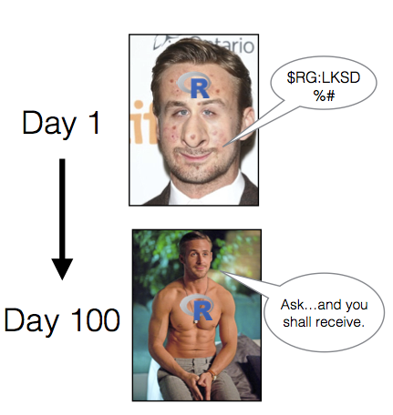

```{r, include = FALSE}
x <- c("tidyverse", "texreg", "tidyr", "lubridate", "knitr", "kableExtra")
lapply(x, require, character.only = TRUE)
```

```{r setup, include = FALSE, echo = FALSE}
knitr::opts_knit$set(root.dir = rprojroot::find_rstudio_root_file())
getwd()  
knitr::opts_chunk$get("root.dir")  # returns 'Users/Me/Docs/Proj'
getwd()
```

`r getwd()`

You will need the following for this workshop

* Working internet connection
* **Software**. R and R Studio (see next section for installation). Preferable to have Microsoft Word. 
* **R Packages**: `tidyverse`, `psych`, `afex`
* **Datasets**: *msleep* (in `tidyverse`), *Cars93* (in `MASS`), *ChickWeight* (base R), and *NAPS.xls*.  

If you’re like most people, you think of R as a statistics program. However, while R is definitely the coolest way to conduct statistics – it’s not really a program. Rather, it’s a programming **language** written by and for statisticians. In this first section, we will navigate the RStudio interface while discussing some basics of the R language. We will also assemble R code which simulates rolling a pair of dice to get familiar with running R commands, creating objects, and using packages. 

# Why Learn R

Beyond its wide use and popularity, here are numerous reasons to adopt R.

1. R is 100% free and as a result, has a huge support community. Unlike SPSS, Matlab, Excel and JMP, R is, and always will be completely free. This doesn’t just help your wallet - it means that a huge community of R programmers will constantly develop an distribute new R functionality and packages at a speed that leaves all those other packages in the dust! The size of the R programming community is staggering. If you ever have a question about how to implement something in R, a quick Google search will lead you to your answer virtually every single time.

2. R is the present, and future of statistical programming. Next to Python, it is ranked as the most in demand languages for data scientists and academics. This virtually guarantees its continued usage for the forseeable future.  

3. R is incredibly versatile. You can use R to do everything from calculating simple summary statistics, to performing complex simulations to creating gorgeous plots. If you can imagine an analytical task, you can almost certainly implement it in R. Below are links to pages or packages illustrating application of R to dyadic data analyses, SEM, networks, polynomial regression, genetic sequencing, and creation of a variety of figures. 

   + [APIM Examples](http://davidakenny.net/DyadR/DyadRweb.htm)
   + [Lavann](http://lavaan.ugent.be/index.html)
   + [Psychometric Network Analyses](https://pdfs.semanticscholar.org/0118/14c5de4c03dee80dfaa90f6ae160e9b3cad4.pdf)
   + [Polynomial Regression Analyses with `RSA` package](https://twitter.com/nicebread303/status/1069873598804955136)
   + [Bioconductor](https://www.bioconductor.org/)
   + [Figures](https://robwschlegel.github.io/Intro_R_Workshop/graphics.html), [example visuals](http://r-statistics.co/Top50-Ggplot2-Visualizations-MasterList-R-Code.html), and [adding statistics](https://github.com/IndrajeetPatil/ggstatsplot)
   
4. Using RStudio, a program to help you write R code, allows you to seamlessly combine R code, analyses, plots, and written text into elegant documents all in one place using Sweave (R and Latex) or RMarkdown. In fact, I translated this entire seminar (the text, formatting, plots, code…yes, everything) in RStudio using Markdown. With RStudio and RMarkdown, instead of trying to manage two or three programs, say Excel, Word and (sigh) SPSS, where you find yourself spending half your time copying, pasting and formatting data, images and test, you can do everything in one place so nothing gets misread, mistyped, or forgotten. I can even make this cool figure right next to my text. 

```{r}
circlize::chordDiagram(matrix(sample(10), 
                              nrow = 2, ncol = 5))
```

5. Analyses conducted in R are transparent, easily shareable, and reproducible. If you ask an SPSS user how they conducted a specific analyses, they will either A) Not remember, B) Try (nervously) to construct an analysis procedure on the spot that makes sense - which may or may not correspond to what they actually did months or years ago, or C) ask you what you are doing in their house. I used to primarily use SPSS, so I speak from experience on this. If you ask an R user (who uses good programming techniques!) how they conducted an analysis, they should always be able to show you the exact code they used. Of course, this doesn’t mean that they used the appropriate analysis or interpreted it correctly, but with all the original code, any problems should be completely transparent!

# Why R is Like a Relationship

R is very much like a relationship. Like relationships, there are two major truths to R programming

<center>
{width=500px}
</center>
<br>
1. There is nothing more *frustrating* than when your code does not work

2. There is nothing more *satisfying* than when your code does work!

Anything worth doing, from losing weight to publishing a paper, takes time. Learning R is no different. Especially if this is your first experience programming, you are going to experience *a lot* of headaches when you get started. You will run into error after error and pound your fists against the table screaming: “WHY ISN’T MY CODE WORKING?!?!? There must be something wrong with this stupid software!!!” You will spend hours trying to find a bug in your code, only to find that - frustratingly enough, you had had an extra space or missed a comma somewhere. You’ll then wonder why you ever decided to learn R when (*sigh*) SPSS was so “nice and easy.”

<center>
{width=400px}
</center>
<br>

# Adopt a Programming Mindset

* **Don't learn toolkits, learn the language.**

Programming is learning a language, one of speaking to a computer. You get better by *doing*, *speaking*, and *thinking* about how the computer is understanding your code. Code itself has verbs, nouns, and syntax which must be mastered bit by bit. It's really easy in SPSS and other progrms to learn things by clicking a button (e.g., the ANOVA button). This is like learning survival phrases as opposed to actually speaking a language. It will get you to a certain point but you will eventually hit a wall.  

<center>
{width=200px}
</center>
<br>

* **Develop code, don't write it.**

Writing implies you just put it down and its done. You should not think of writing code as a task be finished and forgotten. Rather, it is a developmental process in the same way a project or research paper is developmental. You don't just write one draft and say I'm done. You go back, review words and paragraphs, and modify things so they sound better. **That same basic process occurs in programming on a much finer level**. You instead write one or two lines of code at a time, run them, make sure they do what you think, and keep moving. Then you build iteratively one step at a time.

<center>
{width=200px}
</center>
<br>

A **big part** of this is experimentation. Probably the best way to intuitively grasp R is to take others' code and modify it for your data. Alter arguments or variables and see the result. Even better, alter the code until it breaks. Then, understand *why* it broke and fix it.  

<center>
{width=200px}
</center>
<br>

Because a lot of R work with **functions**, you will often want to run each function by itself on some data to see what happens. To do so, always build test code with made-up data. Once you get a feel for one function, then you can **nest** it inside other functions to build increasingly complex lines of code. Conversely, when you find **nested functions** in the wild, it is often helpful to unpack each function and run each by itself to see what it does. In the following image, we might run the mean first to see the result, then run round to see the result. 

<center>
{width=200px}
</center>
<br>

* **Create data pipelines, not stand alone code**

<center>
{width=200px}
</center>
<br>

As you get more fluent in R, you should transition to the idea you can do **everything**  in R from data cleaning, to table creation, to writing your actual manuscript. Eventually, you will want to have one R script which can take your 100% raw data - directly downloaded from excel, Qualtrics, archival data set, or other format - and transorm it into final tables, figures, and text embedded in a document. It should also be portable, meaning you could add a different data-set, repeat the code, and end up with new tables and text. 


# Installing R and R Studio


# R versus R Studio

**R** is a statistical programming language. **Rstudio** is an integrated development environment or IDE for R. It is important to note the difference. R is the base language or "engine" running code while Rstudio is a front-end or "hood" to make R easier to use. In R, you can run many statistical techniques, manipulations, and visualizations. Rstudio, on the other hand, provides a kind of graphical user interface for R by adding interactivity, organization, and greater functionality, such as syntax-hilghlighting editor, plot area for showing graphs, and a work space for viewing loaded data. 

<center>
{width=250px}
</center>
<br>

If you open R directly, you will see a plain old console.

<br>
<center>
{width=300px}
</center>
<br>

You can run all statistical and graphical functionality within base R. For instance, I can create and plot two numerical vectors, x and y.

```{r, evaluate = FALSE}
x <- 1:5
y <- 6:10
plot(x,y)
```

Running the above creates a plot within the R console. If wanting to retrieve `x` and `y` from R's working memory you need to run the `ls()` command. This will display the contents of the current R environment. Finally, you can see base R has menu options but they are fairly limited.

<center>
{width=300px}
</center>
<br>

Now let's compare with R studio. When opened, you see four panels with the R console located in the bottom left. The console is the same R engine we ran before -- you can do all the same stuff here. 

<br>
<center>
{width=600px}
</center>
<br>

Let's enter and plot the same two vectors in the R console. Notice a few changes. First, we can directly see what's in R's working memory in the upper right. Second, all plots are self-contained in the bottom right window, with R studio tracking all images created in a single session. 

<br>
<center>
{width=600px}
</center>
<br>

If you want to save a plot, you can click on the **export** tab, save as an image, and make modifications to the format and dimensions prior to saving. 

<br>
<center>
{width=250px}
</center>
<br>

Importing data also becomes easier. While you can still import data using commands like `read.table`, you can also import data using the **import** dataset tab in the uppper right. We can select from a local file --- meaning it's saved on your computer --- and then use the options available to modify how the data is imported. Below we are selecting the *NAPS* excel dataset. Rstudio also provides a preview of how the data will be formatted once loaded into R. 

<br>
<center>
{width=700px}
</center>
<br>

Once we import the *NAPS* dataset, you'll see it pop up in a tab within the script editor in the upper left. This shows the data in a spreadhseet format similiar to SPSS or excel. You can also sort the data by any variable from highest to lowest or vice versa. 

<br>
<center>
{width=400px}
</center>
<br>

We can also easily create and manage scripts, which are just plain text files with R code. *File* > *New File* > *R Script* in the menu will create an untitled script. Let's do this. In the script, create a new variable, `z`, and assign the values 11 to 15. Then add up x, y, and z using the `sum` command. The output appears in the console. You can save this script as a .R file under *File* > *Save As* which allows you to reproduce your analyses at a later date. 

<br>
<center>
{width=600px}
</center>
<br>

RStudio also directly interfaces with [*RMarkdown*](https://rmarkdown.rstudio.com/) which allows you to turn your code and analyses directly into reports, presentations, and dashboards. Similarly, you can use [*Rprojects*](https://support.rstudio.com/hc/en-us/articles/200526207-Using-Projects) to organize your work by placing all related files and output for a single paper in one spot. 

<br>
<center>
{width=600px}
</center>
<br>


### RStudio Improves Workflow

The point of the above is to show RStudio makes the user experience of working within the R programming language much much nicer! It's a no-brainer: if you're going to work with the R programming language work within the RStudio environment. You'll be happy that you did. 

# R Programming Language

R is a programming language rather than a collection of discrete commands. Because of this, you can combine several commands, each using the output of the previous one (Linux users will recognize the similarity to chaining shell commands using pipes). The ability to combine R functions gives tremendous flexibility and, if used properly, is quite powerful. As a simple example, consider this nested command:

```{r, collapse = TRUE}
nrow(subset(mtcars, cyl == 6))
```

First, the `subset` functions takes the built-in R dataframe `mtcars` and extracts all vehicles for which the variable cylinder has the value of 6. This results in a new, smaller data frame, which is then fed to the `nrow` function. This function counts the number of rows in a frame. The net effect is to report a count of cyl = 7 in the original frame. 

At a very broad level, commands in R are generally made of two parts: **objects** and **functions**. These are separated by the assignment operator '<-' (pronounced get) symbol, which you can think of as meaning 'is created from.' As such, the general form of a command is:

> Object <- Function

This means an 'object is created from function'. An *object* is anything created in R. It could be a variable, collection of variables, statistical model, graph, different operations, etc. Objects can be single values (such as the mean of a set of scores) or collections of information; for example, when you run an analysis, you create an object containing the output of that analysis, which means the object contains many different values and variables. *Functions* are **procedures** that typically take one or more objects as arguments (i.e., inputs), does something to these objects, and then returns a new object. Calculating the mean, running an ANOVA, generating a histogram, or importing data are functions which return new objects or output. 

#### Illustrations

In the following code chunk, I'll define a simple object `heights` made up of 6 height measures using a function 'c()' and then calculate the `mean` of this object. The `concatenate` or `c()` function is first used to group all these numbers together into a single entity or vector which is then assigned the label `heights`. The `mean()` function, in turn, takes a vector object of numeric data, like `heights`, as its argument, calculates the arithmetic mean of those data, then returns a single number (a scalar) as a result. 

```{r}
#1: Create a vector object called heights
heights <- c(5.8, 6.7, 5.2, 5.6, 4.6, 5.9)

#2: Apply the mean() function to the heights object
mean(heights)
```

If we type the commands above into the console and hit return, then object `heights` is created. This object is stored in memory so we can print it to the console or refer to it in future commands.

R also works well with text data, which can similarly be bound together in an object. Below we create an object called Presidents made up of the names of four notable US Presidents. We again use `c()` to group the four names into a single object, surround each name by quotes to indicate each value is a character or string, and then assigned the label 'Presidents'.  

```{r}
Presidents <- c("George Washington", "Thomas Jefferson",
                "Theodore Roosevelt", "Franklin D. Roosevelt")
```

Again, we can view all four names by entering `President` into the console. Or, perhaps we wish to use the `str_subset` function from the `stringr` package to pull out any President with a name containing the letter R.

```{r}
stringr::str_subset(Presidents, "R")
```

## Object-Oriented Programming

As can be seen, R is an object-oriented language. This means variables, datasets, graphs, and programs are represented as in R's memory and directly manipulated. Hence, we might represent the number 7 as `x`, 8 as `y`, and then add `x + y` to produce 15.

The advantage of object orientation can be explained by an example. Consider statistical regression. When you perform a regression analysis with other statistical packages, such as SAS or SPSS, you get a mountain of output on the screen. By contrast, if you call the `lm` regression function in R, the function returns an *object* containing all the results -- the estimate coefficients, their standard errors, residuals, and so on. You then pick and choose, programmatically, which parts of that object to extract. 

For instance, we may desire to regress miles per gallon upon vehicle weight using R's built-in `mtcars` dataset. We will store the results of this analysis in the object *cargas*

```{r}
cargas <- lm(mpg ~ wt, mtcars)
```

We can view all the information stored within this object using the `attributes` function. R recognizes this as a class from `lm` and provides everything stored in this object under the names attribute. 

```{r}
attributes(cargas) 
```

We can access this output directly using the `$` sign, request a `summary` of the model, or feed the object into the `plot` function. For instance, we might just want the model coefficients and predicted mpg for the first four vehicles.  

```{r}
cargas$coefficients; cargas$fitted.values[1:4]
```

You will see that R’s approach makes programming much easier, partly because it offers a certain uniformity of access to data. This uniformity stems from the fact that R is *polymorphic*, which means that a single function can be applied to different types of inputs, which the function processes in the appropriate way. Such a function is called a generic function (If you are a C++ programmer, you have seen a similar concept in virtual functions). 

For instance, consider the `plot` function. If you apply it to a list of numbers, you get a simple plot. But if you apply it to the output of a regression analysis, you get a set of plots representing various aspects of the analysis. Indeed, you can use the `plot` function on just about any object produced by R. This is nice, since it means that you, as a user, have fewer commands to remember!

## Functional Programming

*Insert Content*

# Orientation to R

This section adapts the structure and examples from Garret Grolemund's excellent [Hands on Programming with R](https://rstudio-education.github.io/hopr/) to provide a broad overview of the R language. We will build a pair of virtual dice you can roll to generate random numbers. 

In general, a die has six possible values: 1, 2, 3, 4, 5, and 6. Each time it is rolled it will return one of these numbers. You could capture the essence of a dice by saving the numbers 1 to 6 as a group of values, or a single object, into R's memory. Let's first work on saving these numbers and then consider a function which allows us to "roll" the dice. We will introduce each pane of R studio along the way.

## R Studio Interface

Before you can ask your computer to save some numbers, you’ll need to know how to talk to it. That’s where R and RStudio come in. RStudio gives you a way to talk to your computer. R gives you a language to speak in. To get started, open RStudio just as you would open any other application on your computer. You should see three or four panes (the script file or source pane may be minimized) like those displayed below. If you'd like, you can change the order under *Tools* > *Global Options* > *Pane Layout*. You can also change their shape by either clicking the minimize or maximize buttons on the top right of each panel, or by clicking and dragging the middle of the borders of the windows. 

```{r echo=F, out.width='100%'}
include_graphics('C:/Users/Simmy56/Documents/IO Psychology/TA-RA/Teaching/R Data Analysis and Programming/R Day Seminar/Figures/RPanes.png')
```

You can quickly switch between the source and consoles using **Ctrl** (or **Command** on a Mac) and a number corresponding to the desired pane. The two you will be jumping between most frequently are *Source Editor* (**1**; labeled **Script Files** above) and *Console* (**2**). Other preset windows are *Help* (**3**), *History* (**4**), *Plots* (**5**), and *Environment* (**8**). By adding *Shift* to any of these combinations you can also toggle maximize pane for the one you are switching to at the same time, very handy if you need a broader perspective. You can hit **Ctrl+Shift+Alt+0** to revert back to displaying all four panes. 

RStudio offers many handy **keyboard shortcuts** which can greatly accelerate your workflow. **Alt+Shift+K** brings up a keyboard shortcut reference card. Here is a list of my favorite which I frequently use and will reference later:


```{r, echo = F}

dt <- data.frame(Function = c("Run lines of code",
                              "Highlight multiple lines of code",
                              "Delete current line/selection",
                              "Move lines of code up and down (rather than cut/paste)",
                              "Insert an R Section",
                              "Collapse/Open R sections (also other types of sections)",
                              "Run current R section",
                              "Run whole script",
                              "Comment out code by inserting a hashtag (#)",
                              "Re-run previously run code region with any changes",
                              "Automatic indentation of code",
                              "Insert assignment operator (<-)",
                              "Switch back and forth between tabs",
                              "Search through open tabs",
                              "In console, visually search previously executed commands",
                              "Clear console"),
                 Key =      c("Ctrl + Enter",
                              "Shift + Up/Down",
                              "Ctrl + D",
                              "Alt + Up/Down",
                              "Ctrl + Shift + R",
                              "Alt + L/Alt + Shift + L",
                              "Ctrl + Alt + T",
                              "Ctrl + Alt + R",
                              "Ctrl + Shift + C",
                              "Ctrl + Shift + P",
                              "Ctrl + I",
                              "Alt + (-)",
                              "Ctrl + Tab/Ctrl + Shift + Tab",
                              "Ctrl + Shift + .",
                              "Ctrl + Up",
                              "Ctrl + L"
                              ))

dt %>% kable() %>% kable_styling(bootstrap_options = c("striped", "hover", "condensed"), full_width = F) %>% column_spec(1, width = "35em") %>% column_spec(2, bold = T) 
```

#### **R Console: the Heart**

The bottom left pane is the **R Console**, or the heart of R. This is where code is evaluated and results returned. At the beginning of the console you'll see the **>** character, a prompt indicating R is ready for new code. Simply type code into the console and hit Enter to run it. The code you type is called a *command*, because it will command your computer to do something. 

When you run a command, the computer executes it and shows the results. Then RStudio displays a fresh prompt for your next command. For example, if you type `1 + 1` and hit Enter, RStudio will display:

```{r eval = FALSE, error = TRUE}
> 1 + 1
[1] 2
```

You'll notice a `[1]` appears next to your result. This means the line begins with the first value in your result. Some commands return more than one value, and their results may fill up multiple lines. For example, the command `10:30` returns 20 values; it creates a sequence of integers from 10 to 30. Notice new bracketed values appear at the start of new lines. These numbers indicate the position or *index* of the value within the object. Consider the following example:

```{r, evaluate = FALSE, error = T}
# > 10:30
# [1] 10 11 12 13 14 15 16 17 18
# [10] 19 20 21 22 23 24 25 26 27
# [19] 28 29 30
```

Here R counts 19 as the 10th value in the vector and 28 as the 19th. At the beginning of every line, R tells you the index of the first value in that line. We will return to indexing later. 

If you type an incomplete command and press Enter, R will display a `+` prompt, which means R is waiting for you to type the rest of your command. Either finish the command or hit **Escape** to start over:

```{r, evaluate = FALSE}
# > 5 -
# +
# + 1
# [1] 4
```

If you type a command R doesn’t recognize, R will return an error message. If you ever see an error message, don’t panic. R is just telling you it couldn’t understand or do what you asked. Errors are often a good time to pause, diagnose, and think about why problems are arising in your code. 

```{r eval = F, error = TRUE}
5 * abc
```

Once you get the hang of the command line, you can easily do anything in R that you would do with a calculator. For example, you could do some basic arithmetic.

```{r}
3 * 10
6 / (4 - 1)
sqrt(20)^2
```

Further mathematical operations include:

* Addition: `+`
* Subtraction: `-`
* Multiplication: `*`
* Division: `/`
* Exponentiation: `^`
* Modulo: `%%`

The `^` operator raises the number to its left to the power of the number to its right: for example `3^2` is `9`. The modulo returns the remainder of the division of the number to the left by the number on its right, for example 5 modulo 3 or `5 %% 3` is 2.

R follows order-of-operations and groupings based on parentheses.

```{r}
5 + 4 / 9
(5 + 4) / 9
```

##### Exercise - Arithmetic

Think you have the basic grasp for executing R code? If so, try carrying out the following calculations. If you do it correctly, you should end up with the same number you started with. 

1. Choose any number and add 2 to it
2. Multiply the result by 3
3. Subtract 6 from the answer
4. Divide what you get by 3

<br></br>

##### Solution - Arithmetic

You could start with the number 99, and then do the following steps:

```{r, collapse=TRUE}
99 + 2
101 * 3
303 - 6
297/3
```

Or, you could run as follows

```{r}
(((99+2)*3) - 6)/3
```

#### **Workplace Environment: the Memory**

The upper right pane is R's working memory. It displays objects (data, values, functions) in the environment pane while the history window shows all executed commands during the current session. We will first discuss objects and then commands for working with your R environment. 

##### **Objects**

Now that we know how to use R, let's use it to make a virtual die. The `:` operator from above gives a nice way to a create a group of numbers in a sequence. The `:` operator returns its results as a **vector**, a one-dimensional set of numbers.

```{r}
1:6
```

This is what a virtual dice looks like! But, where does this information go? Running `1:6` generated the numbers, but it did not store the vector anywhere in your computer's memory. If you want to re-use those (or other) numbers again, you'll have to ask your computer to save them somewhere. You can do that by creating an R **object**. 

R lets you save data by storing it inside an R object. What is an object? Just a name that you can use to call up stored data. For example, you can save data into an object like `a` or `b` using the assignment operator `<-`. Whenever you apply the object, R will replace it with the data saved inside. For example

```{r}
a <- 1
a + 2
```

Note you can also change a variable's value by assining it a new one

```{r}
a <- 11
a + 2
```

This means assigning a value to one variable does not change values of other variables. For example, let's store the result of `a` plus 100 in another variable

```{r}
b <- a + 100
```

and then change `a` to 0.

```{r}
a <- 0
```

What do you think the current content of objec `b` is, 100 or 111? Try it out and see. 

##### Exercise - Updating Objects

Without using R, what are the values of the following? After solved, check your answer in R.

```{r}
mass <- 50              # mass?
age  <- 30              # age?
mass <- mass * 2        # mass?
age  <- age - 10        # age?
mass_index <- mass/age  # massIndex?
```

***

You will makes lots of assignments and the `<-` operator can be a pain to type. Instead, use RStudio's keyboard shortcut: **Alt+-** (the minus sign). Object names cannot start with a digit or contain certain other characters such as a comma or a space. So, for another example, the following code would create an object named `die` that contains the numbers one through six. To see what is stored in an object, just type the object’s name by itself:

```{r}
die <- 1:6

die
```

When creating objects, it is wise to provide informative names and adopt a [convention for demcarcating words](https://en.wikipedia.org/wiki/Snake_case) in names. Let's make another assignment.

```{r}
this_is_a_really_long_name <- 2.5
```

To inspect this, try out RStudio's **completion facility**: type the first few characters, press **Tab**, add characters until you disambiguate, then press Return. This auto-completion comes in handy when there are many objects and datasets you need to reference. This feature also provides brief inline help for functions. For example, type `mean()` and press the **Tab** key to acess the arguments. 

Make another assignment.

```{r}
katherine_rocks <- 2 ^ 3
```

Note R is **very** precise in labels. Let's inspect the object

```{r eval = F, error = TRUE}
katherinerocks
```
```{r eval = F, error = TRUE}
Katherine_rocks
```

The implicit deal you make with a computer: it will do tedious computations for you but, in return, you must be exact in your instructions. Typos matter. Case matters. Missing commas matter. Get better at typing.

Often you may want to **re-excute commands** previously entered. Rather then type it out, the console can recall previous commands using the arrow keys: 

* **Up** -- Recall previous command(s)
* **Down** -- Reverse of Up

You can view an entire list of your recent commands by pressing **Ctrl+Up** on Windows (or **Command+Up** on Mac). 

It is important to remember everything in R --- including datasets, output, and functions --- are stored as objects. For example, we can store R's built-in dataset about cars as a new object.

```{r}
car_data <- mtcars
head(car_data)
```

##### **Environment Pane**

The Environment pane shows the names of all data objects (like vectors, dataframes, matrices) that you've defined in your current R session. My current environment includes all the objects created above.

<br>
<center>
{width=500px}
</center>
<br>

You can also see object information, like the number of observations and rows in datasets. I have expanded the `car_data` object by clicking on the blue arrow. This shows the dataset's variables. The pane has additional tabs for data importation, connecting to external servers or databases, and working with version control. 

You can get a listing of all current objects with commands `objects()` or `ls()`. If you want to remove the object named `a`, you can do this:

```{r}
rm(a)
```

To remove everything:

```{r}
rm(list = ls())
```

or click the **broom** in RStudio's Environment pane. 

As a final note, R will overwrite an previous information stored in an object without asking you for permission. So, it is a good idea to **not** use names that are already taken.

```{r}
x <- c(1, 2, 3)
x
```

```{r}
x <- c(4, 5, 6)
x
```

You now have a virtual `die` that is stored in your computer’s memory. You can access it whenever you like by typing the word `die`. So what can you do with this die? Quite a lot. R will replace an object with its contents whenever the object’s name appears in a command. So, for example, you can do all sorts of math with the die. So let’s take a look at how to do that:

```{r}
die <- c(1,2,3,4,5,6)
die - 1
die / 2
die * die
```

You can likely see a pattern. R uses **element-wise execution**. When you manipulate a set of numbers, R applies the same operation to each element in the set. So for example, when you run `die - 1`, R subtracts one from every value of `die`.

When you use two or more vectors in an operation, R lines up the vectors and performs a sequence of individual operations. For example, when you run `die * die`, R lines up the two `die` vectors and multiplies the first element of vector 1 by the first element of vector 2. R then multiplies the second element of vector 1 by the second element of vector 2, and so forth, until every element has been multiplied. The result is a vector of the same length as the first two, as visualized below. 

<br>
<center>
{width=500px}
</center>
<br>

**Element-wise operations** are a very useful feature because they manipulate groups of values in an orderly way. When you start working with data sets, element-wise operations will ensure that values from one observation or case are only paired with values from the same observation or case. Element-wise operations also make it easier to write your own programs and save the output of your results as new objects. Take the following examples.

```{r}
# creating new objects using other objects
die_minus_one <- die - 1

#create probability table
die_prob <- rep(1/length(die), length(die))       # number desired outcomes / number possible outcomes
cum_prob <- die / 6                               # cumulative prob: rolling anything <= to chosen number
die_table <- data.frame(die, die_prob, cum_prob)  # Combine different objects into a table
die_table                                         # Display newly created die_prob and cum_prob vectors alongside die values 
```

The first example stores the object `die_minus_one` in your environment. Whenever altering datasets or variables, it is recommended you store results as a new object rather than overwriting old ones. This keeps a record of your decision making. The second example shows how we run various calculations on `die`, save these as their own objects, and then combine these objects into a data set (more on this later in the R objects section). Each appears as a new object in the **Environment** pane.

Note how `cum_prob` calculates values across `die` to produce a vector showing the increasing likliehood of rolling a number equal to or less than a chosen value. For example, you are 100% guaranteed to get at least a 6 or less on any given role. This shows the power of R's element-wise operations to produce new information from within our data. Statistical tests, transformations, and scoring items are examples where we run a function on a vector to produce new insights we store and use later. 

#### **R Source/Script Editor: The Notepad**

Now that we can do math with your `die` object, let's look at how you could "roll" it. Rolling your die will require something more sophisticated than arithmetic; you'll need to randomly select one of the die's values. For that you will need a *function*. 


As we begin assembling...

The **Source** pane in the upper left is where you create and edit R Scripts -- your collections of code. This is basically a notepad of all your notes and actions. RStudio's source editor supports nifty features, like syntax higlighting, code completion, and find/replace to make it easier to manage. R scripts exist as text files with the ".R" extension. When you open R Studio, it will automtaically start a new Untitled script. 


While you can run code either from the source or by typing in the Console, 99% of the time you should  use the source. The reason is straightforward: if you type code in the console, it won't be saved (although you can review in history). If you make a mistake in the console, you'd have to re-type everything all over again. If you .... 

##### **Files, Plots, Packages, Help, and Viewer panes**

The last pane in the bottom right has a number of different tabs. 

The **Files** tab allows you to navigate your file system without leaving RStudio. By default it will display your working directory. The meaning of the icons are as follows:

*  create a new folder in the current directory
*  upload a file (note: this open does not exist on local RStudio installations)
*  delete selected files or folders
*  rename selected file or folder
*  dropdown of additional options, including copying or moving files as well as setting or moving to your working directory. 

In order to delete, rename, copy, or move a file, you must select the file(s) that you want to operate on by clicking the white box next to it, so that a check appears. **Warning**: deleting a file from within RStudio also **deletes** it from your local file system. 

Moving forward, the **Plots** tab is where graphics you create will appear. The meaning of its icons are as follows:

*  return to the previous plot
*  go to the next plot
*  open plot in new, larger window
*  save current plot as image or PDF
*  delete the current plot
*  delete all plots

Let’s see how plots are displayed in the **Plots** panel. Run the code below to display a histogram of the weights of chickens stored in the `ChickWeight` dataset. When you do, you should see a plot similar to the one below show up in the Plots panel.

```{r}
hist(x = ChickWeight$weight,
     main = "Chicken Weights",
     xlab = "Weight",
     col = "skyblue",
     border = "white")
```

One of the great features of RStudio's **Plot** tab is its ability to keep a history of all the plots you have created, and to jump back and forth between them by using the Previous and Next button. Run the following code to create a scatterplot between a chicken's weight and number of days since birth. Once it appears, you can click on the *Previous* and *Next* buttons to switch between both figures. 

```{r}
plot(ChickWeight$weight, ChickWeight$Time,
     xlab = "Time", ylab = "Weight",
      col = "skyblue")
```

The third tab, **Packages**, shows a list of all R packages installed on your hard drive and indicates if they are currently loaded. Loaded packages are checked while those which are installed but not loaded are unchecked. Finally, the **Help** menu provides all help documents for R functions. You can type the name of a function in the search window, or use the code to search for a function with the name. We will discuss more on packages and help functions in a few sections. 

```{r}
?hist   # How does the histogram function work?
?t.test # What about a t-test?
```

# Coding Efficiently

...


# Packages

R exists as a base package with a reasonable amount of functionality. Once you've downloaded and installed R, you can start analyzing and visualizing data. However, the beauty of R is that it can be expanded by downloading packages that add specific functionality to the program. Anyone with a big enough brain and a bit of time and dedication can write a package for other people to use. These packages, as well as the software itself, are stored in a central location known as the CRAN (Comprehensive R Archive Network). Once a package is stored in the CRAN, anyone with an Internet connection can download it from the CRAN and install it to use within their own copy of R. 

```{r, echo=F, out.width='100%', fig.align="center"}
include_graphics('C:/Users/Simmy56/Documents/IO Psychology/TA-RA/Teaching/R Data Analysis and Programming/R Day Seminar/Figures/Cran.png')
```

The CRAN is central to using R: it is the place from where you download the software and any packages that you want to install. It would be a shame, therefore, if the CRAN were one day to explode. The statistical world might collapse. Even assuming the internet does not metldown, it is still a busy place. Therefore, rather than have a single CRAN location that everyone accesses, the CRAN is ‘mirrored’ at different places across the globe. ‘Mirrored’ simply means that there are identical versions of the CRAN scattered across the world. If I resided in Ireland, I might access a CRAN location in Ireland, whereas if you are in a different country you would likely access the copy of the CRAN in your own country (or one nearby). Bigger countries, such as the US, have multiple CRANs to serve them: the basic philosophy is to choose a CRAN that is geographically close to you.

### Package Installation

There are two primary ways to install packages. First, we can use the `install.packages` command and input the name of the desired packaged as a string. We will be using the `afex` package later, which can be installed by running `install.packages("afex")`. 

A second option is the *packages* tab in the display pane (lower right) within Rstudio. The tab displays all downloaded packages in the user library. Click on the *Install* button and type the name of the desired package in the prompt. Rstudio provides an auto-complete drop down list of packages matching entered characters which you can use to identify a desired package. 

<center>
{width=350px}
</center>

### Loading Packages

Once you've installed a package, it's there for life unless you uninstall it. However, you must load the library before the package's functionality is available. This is done with the `library` command. 

```{r}
library(afex)
```

Once loaded you can now use all the `afex` commands. However, any loaded package disappears when ending an R session. So you must load all desired packages each time you start R.

I suggest including a vector of package names at the top of your script and then running the following code to load everything in one go. The code below includes 5 different packages I often use, each with specialized capabilities. 

```{r, evaluate = FALSE}
x <- c("tidyverse", "MplusAutomation", "texreg", "tidyr", "lubridate")
lapply(x, require, character.only = TRUE)
```

### Getting Help with R and Packages

There are a number of different ways to get help in R, most of which broadly come from either internal help systems or online. We will look at internal systems first followed by online resources.

#### Internal Options

The broadest options are available in the Help menu, including shortcuts, cheat sheets, and documentation provided both from R and R Studio staff. More general manuals and guides can be found under R help or, equivalently, by executing `help.start()`.

<center>
{width=400px}
</center>
<br>
To get help on a specific function, dataset, or object that you know the name of, use `?` or, equivalently, `help`. This provides access to the documentation pages. The following command provides information on the use, arguments, and returned value for the `mean` function. 

```{r}
?mean
help(mean) #same
```

You may also use the `help` function to access information about a package in your library --- for example, `help(package="dplyr")` --- which displays an index of help pages for the package along with other information. 

If you don't know the name of the command you are looking for, then you can use `??` or, equivalently, `help.search`. These scan the documentation for packages installed in your library, including help pages, vigenttes, and demos. For instance, running `help.search("effect size")` on my machine returns functions related to computing Cohen's D, partial eta squared, and numerous others. 

<br>
<center>
{width=500px}
</center>
<br>

Perhaps the most useful sort of help are *vignettes*. These are how-to guides for topics, and usually offer gentle introductions and examples. To get a list of all available vignettes type `vignette()` followed by the return key. `browseVignettes` provides the same list but opened in your webbrowser with links to pdfs and online documentation. Once you see one you are interested in use the `openVignette()` command to open it.

#### Online Resources

[Rstudio](https://www.rstudio.com/online-learning/) provides some of the best resources on the web for broadening your skills in R. Perhaps their best resource is a set of [cheatsheets](https://www.rstudio.com/resources/cheatsheets/) providing quick visual references for how popular packages and functions operate. Below is an example of the `tidyr` cheatsheet showing how to reshape datasets.  

<center>
{width=700px}
</center>
<br>

[R Bloggers](https://www.r-bloggers.com/) aggregates blogs written in English from across the globe. This is the first place you want to visit if you want tutorial help with R, data analysis, visualization and machine learning. There are blogs on a wide range of topics, including running [latent class analysis](https://www.r-bloggers.com/example-8-21-latent-class-analysis/), [logistic regression](https://www.r-bloggers.com/how-to-perform-a-logistic-regression-in-r/), and tips for [importing data](https://www.r-bloggers.com/importing-data-into-r/). You can subscribe for regular updates and, if you are a blogger yourself, share it with the R community by adding your blog to R Bloggers.

<center>
{width=400px}
</center>
<br>


Finally, [Stack Overflow](https://stackoverflow.com/questions/tagged/r) is a great place to visit if you are having trouble with R code or packages. Chances are high that someone has already encountered the same or similar problem and you can use the answers given by R experts. In case you have encountered a new problem or issue, you can ask for help by providing a reproducible example of your analysis along with the R code. Use the `reprex` package to create reproducible examples.
<br><br>
<center>
{width=400px}
</center>
<br>

The package `errorist` provides added support for R newcomers by automatically searching the web for solutions whenever R throws and error or warning. This will often redirect to a relevant stack overflow solution.
<br><br>
<center>
{width=350px}
</center>
<br>

### Finding Packages

You can find a complete list of packages at [cran.R-project.org](https://cran.r-project.org/) by clicking on *Packages* on the sidebar. You can search for available packages sorted by name or by day of publication. 
<br><br>
<center>
{width=400px}
</center>
<br>

If looking for a specific type of function, the site [search.r-project.org](http://search.r-project.org/) is similiar to `help.search` but uses the internet to search for information in function help pages and vignettes for all CRAN packages. For instance, if we search for "heart rate variability" we find several functions from the RHRV package which perform spectral analyses on heart rate data. A simply Google query will likely lead you to the same results. If it is a common problem in your field, chances are someone has tried to solve it and uploaded their package to CRAN.   

There are additional options within R. `available.packages` tells you all the packages that are available in the repositories that you set via `setRepositories`. `installed.packages` tells you all the packages that you have installed in all the libraries specified in `.libPaths`.  `library` (without any arguments) is similar, returning the names and tag-line of installed packages.

```{r libraries, eval = FALSE}
View(available.packages())
View(installed.packages())
library()
.libPaths()
```

Similarly, `data` with no arguments tells you which datasets are available on your machine. `search` tells you which packages have been loaded while `packageDescription` shows you the contents of a package's `DESCRIPTION` file.

```{r data}
data()
search()
packageDescription("dplyr")   
```

There are currently over 10,000 packages available. Several can be fairly specific. For instance, the `abc` package provides tools for approximate Bayesian Computation while the `acc` packages is for accelerometer data. While many helpful packages exist, navigating them can be a challenge. Below is a guide to some frequently used R packages by data scientists as indexed by citations and CRAN downloads.  

#### Loading Data

[DBI](https://db.rstudio.com/dbi/) - The standard for for communication between R and relational database management systems. Packages that connect R to databases depend on the DBI package.

[odbc](https://db.rstudio.com/odbc/) - Use any ODBC driver with the odbc package to connect R to your database. Note: RStudio professional products come with professional drivers for some of the most popular databases.

[RMySQL](https://www.rdocumentation.org/packages/RMySQL/versions/0.10.17/topics/MySQLDriver-class), [RPostgresSQL](https://db.rstudio.com/databases/postgresql/), [RSQLite](https://www.rdocumentation.org/packages/RSQLite/versions/2.1.1) - If you'd like to read in data from a database, these packages are a good place to start. Choose the package that fits your type of database.

[XLConnect](https://cran.rstudio.com/web/packages/XLConnect/), [xlsx](https://cran.rstudio.com/web/packages/xlsx/) - These packages help you read and write Microsoft Excel files from R. You can also just export your spreadsheets from Excel as .csv's.

[foreign](https://cran.r-project.org/web/packages/foreign/index.html) - Want to read a SAS data set into R? Or an SPSS data set? Foreign provides functions that help you load data files from other programs into R.

[haven](https://www.rdocumentation.org/packages/haven/versions/2.1.0) - Enables R to read and write data from SAS, SPSS, and Stata.

R can handle plain text files – no package required. Just use the functions read.csv, read.table, and read.fwf. If you have even more exotic data, consult the CRAN [guide](https://cran.rstudio.com/doc/manuals/R-data.pdf) to data import and export.

#### Manipulating data

[dplyr](https://blog.rstudio.com/2014/01/17/introducing-dplyr/) - Essential shortcuts for subsetting, summarizing, rearranging, and joining together data sets. dplyr is our go to package for fast data manipulation.

[tidyr](https://blog.rstudio.com/2014/07/22/introducing-tidyr/) - Tools for changing the layout of your data sets. Use the gather and spread functions to convert your data into the [tidy](https://r4ds.had.co.nz/tidy-data.html) format, the layout R likes best.

[stringr](https://journal.r-project.org/archive/2010-2/RJournal_2010-2_Wickham.pdf) - Easy to learn tools for regular expressions and character strings.

[lubridate](https://lubridate.tidyverse.org/) - Tools that make working with dates and times easier.

#### Visualizing data

[ggplot2](https://ggplot2.tidyverse.org/reference/) - R's famous package for making beautiful graphics. ggplot2 lets you use the grammar of graphics to build layered, customizable plots.

[ggvis](http://ggvis.rstudio.com/) - Interactive, web based graphics built with the grammar of graphics.

[rgl](http://rgl.neoscientists.org/about.shtml) - Interactive 3D visualizations with R

[htmlwidgets](http://www.htmlwidgets.org/) - A fast way to build interactive (javascript based) visualizations with R. Packages that implement htmlwidgets include:

* [leaflet](http://rstudio.github.io/leaflet/) (maps)
* [dygraphs](http://rstudio.github.io/dygraphs/) (time series)
* [DT](https://rstudio.github.io/DT/) (tables)
* [diagrammeR](http://rich-iannone.github.io/DiagrammeR/) (diagrams)
* [network3D](http://christophergandrud.github.io/networkD3/) (network graphs)
* [threeJS](https://github.com/bwlewis/rthreejs) (3D scatterplots and globes).

[googleVis](https://cran.rstudio.com/web/packages/googleVis/) - Let's you use Google Chart tools to visualize data in R. Google Chart tools used to be called Gapminder, the graphing software Hans Rosling made famous in hie TED talk.

#### Modeling data

[car](https://cran.r-project.org/web/packages/car/index.html) - car's Anova function is popular for making type II and type III Anova tables. Includes many additional functions applied to fitted regression models. 

[mgcv](https://www.rdocumentation.org/packages/mgcv/versions/1.8-28/topics/mgcv.package) - Generalized Additive Models

[lme4](https://www.rdocumentation.org/packages/lme4/versions/1.1-21/topics/lme4-package)/[nlme](https://www.rdocumentation.org/packages/nlme/versions/3.1-140/topics/nlme) - Linear and Non-linear mixed effects models

[randomForest](https://www.rdocumentation.org/packages/randomForest/versions/4.6-14/topics/randomForest) - Random forest methods from machine learning

[multcomp](https://www.rdocumentation.org/packages/multcomp/versions/1.4-10) - Tools for multiple comparison testing

[vcd](https://www.rdocumentation.org/packages/vcd/versions/1.4-4) - Visualization tools and tests for categorical data

[glmnet](https://www.rdocumentation.org/packages/glmnet/versions/2.0-18/topics/glmnet) - Lasso and elastic-net regression methods with cross validation

[survival](https://cran.r-project.org/web/packages/survival/index.html) - Tools for survival analysis

[caret](https://cran.rstudio.com/web/packages/caret/) - Machine learning tools for training regression and classification models

#### Reporting results

[shiny](http://shiny.rstudio.com/) - Easily make interactive, web apps with R. A perfect way to explore data and share findings with non-programmers.

[R Markdown](http://shiny.rstudio.com/) - The perfect workflow for reproducible reporting. Write R code in your markdown reports. When you run render, R Markdown will replace the code with its results and then export your report as an HTML, pdf, or MS Word document, or a HTML or pdf slideshow. The result? Automated reporting. R Markdown is integrated straight into RStudio.

[xtable](http://shiny.rstudio.com/) - The xtable function takes an R object (like a data frame) and returns the latex or HTML code you need to paste a pretty version of the object into your documents. Copy and paste, or pair up with R Markdown.

